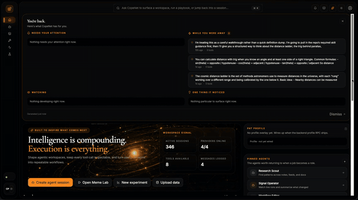
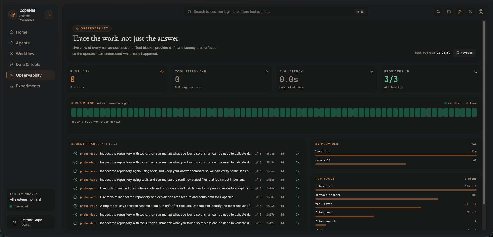

# CopeNet




CopeNet is a *continuity engine* agent operator for people who want more than a chat box. It gives you a persistent workspace for running local and CLI-backed models, inspecting what they actually did, and turning useful sessions into repeatable workflows.

> **Meet the Custodian** — badge says `ACCESS EVERYWHERE`, patch says `DON'T WRITE. DELETE.` He's got the keys to every session, a rubber duck for the hard bugs, and a mop that's seen things. He keeps the transcripts append-only and the worktrees swept. The harness is the building; he's the night shift.

<br clear="right" />


## Product Tour

### Home Dashboard — workspace overview and operator launchpad
The Home dashboard is the front door to CopeNet: the operator console with live workspace signal (active sessions, provider health, tools available), recent activity, system health, quick-start actions, and an ambient NASA *Picture of the Day* to orient you when you sit back down.


### Agents Console — persistent sessions with inspectable runtime context
The Agents view keeps the live conversation and the runtime inspector together so a run stays understandable instead of turning into opaque chat history. Here a sub-agent delegation session shows the model's actual tool calls (test runs, `py_compile`, `git status`) and reasoning inline, while the inspector on the right rolls the run up into grouped activity — "Edited 6 files · Read 10 files" — plus the locked provider, model, mode, and persona.


### Workflows — purpose-built operator surfaces beyond a single chat
The Workflows section is where CopeNet starts feeling like an operator studio instead of a prompt box: focused workflow entrypoints, scoped task surfaces, and room for productized agent behaviors that deserve more than one conversation pane.


### Data & Tools — the workspace plumbing that keeps runs useful
Data & Tools gathers the practical substrate around the agent: imported assets, source material, tool surfaces, and the structured inputs that make later runs more reusable and less ad hoc.


### Persona Home — give CopeNet a stable self, per model
Persona Home makes identity explicit and editable instead of spooky. Pick or create a persona, switch the active one per runtime, and edit the underlying identity files (`SOUL.md`, `IDENTITY.md`, `USER.md`, …) right in the inline editor. The model can even author a whole persona on request — just ask it to build one and it fills the files itself. Personas live in a plain folder of markdown you fully control.


### Observability — trace the work, not just the answer
The Observability surface exposes run pulse, recent traces, provider distribution, and top tool activity so you can inspect what the system actually did across sessions.



### Experiments Matrix — compare behavior across providers and models
Experiments makes evaluation legible by surfacing provider × model runs in one place, making it easier to compare speed, tool behavior, and prompt-following drift.


### Access & Permissions — operator-grade trust, not all-or-nothing
Permissions are their own axis, separate from behavior. Every session picks an **Access** level — **Read-only** (reads + a safe shell allowlist), **Ask** (anything off-allowlist pauses for your approval instead of silently failing), or **Full Access** (writes + unrestricted shell, gated to trusted frontier providers). When a command pauses, the approval card surfaces inline — on desktop *and* mobile — with **Approve**, **Reject**, or **Always allow**. "Always allow" writes the command to a global, persisted allowlist you can edit any time, so the things you trust stop nagging you. Access (and the model, same provider) can even change mid-session, while every run stays stamped with exactly what it used.


## Why CopeNet

Most local AI tools stop at “send a prompt, get a reply.” CopeNet is built for the workflows that happen after that:

- **Operate locally**: keep models, transcripts, and sensitive context close to your machine
- **Inspect runs**: see traces, tool activity, runtime drift, and session state instead of guessing
- **Reuse workflows**: move from one-off chats to repeatable operator surfaces
- **Compare runtimes**: lock sessions to provider/model combinations so behavior stays explainable
- **Extend without cloud lock-in**: add prompts, tools, workflows, and knowledge sources without giving up local control

## What You Can Do

CopeNet is evolving into an operator workspace, not just a chat client. Today it already supports:

- **Agent sessions** with persistent transcripts, first-send runtime binding (provider/profile lock; model + Access changeable mid-session), archive/restore, and inline tool execution
- **Observability** with run pulse views, recent traces, provider/tool distributions, and session activity inspection
- **Workflow surfaces** such as `Meme Lab`, built on top of a stateless ideation API for structured local-model generation
- **Media imports** for transcription and download-first workflows, including mobile-friendly remote use over Tailscale
- **Experiments** for comparing provider/model behavior across real runs
- **Profile + Access layering**: behavioral Profiles (markdown presets) plus a separate **Read-only · Ask · Full Access** permission axis with operator approvals and a persisted shell allowlist

## Providers

CopeNet currently supports local, CLI-backed, and subscription-backed runtimes through a shared harness:

- `codex-cli` — local Codex CLI subprocess
- `claude-cli` — local `claude` CLI subprocess
- `openai-codex` — OpenAI Codex via OAuth (`uv run copenet auth login --provider openai-codex`)
- `lm-studio` — local LM Studio HTTP server
- `ollama` — local Ollama daemon

The goal is provider-agnostic operator tooling: one workspace, multiple runtimes, consistent session semantics. See [`docs/CAPABILITY-MATRIX.md`](docs/CAPABILITY-MATRIX.md) for tool-loop and feature support per provider.

## Quickstart

### 1) Prerequisites

- Python 3.11+
- [`uv`](https://docs.astral.sh/uv/)
- Optional local runtimes:
  - Ollama running on `http://127.0.0.1:11434`
  - LM Studio local server on `http://127.0.0.1:1234`
- Optional CLI runtimes:
  - Codex CLI installed and authenticated (for `codex-cli`)
  - Claude CLI on PATH (for `claude-cli`)
- Optional subscription-backed runtime:
  - OpenAI Codex OAuth via `uv run copenet auth login --provider openai-codex`

### 2) Install dependencies

```bash
uv sync
```

### 3) Run CopeNet

```bash
uv run copenet
```

Open the desktop UI at:

- `http://127.0.0.1:17123`

### 4) Optional: open it remotely on your own devices

CopeNet also works well over your tailnet for private mobile access:

```bash
COPNET_HOST=0.0.0.0 COPNET_PORT=17123 uv run copenet
```

Then open it from another device using your Tailscale hostname or tailnet IP.

## Local Setup Notes

1. Start your local runtimes first (Ollama and/or LM Studio).
2. Run `uv run copenet`.
3. Open the UI and create a new session.
4. Pick provider, model, profile, and task mode.
5. Send the first message to create and lock that session.

If you want to compare another runtime/model combination, start a new chat rather than mutating the existing one.

## Configuration

Environment variables:

- `COPNET_HOST` (default: `127.0.0.1`)
- `COPNET_PORT` (default: `17123`)
- `COPNET_TOKEN` (default: `dev-token`)
- `COPNET_DATA_DIR` (default: `~/.copenet/sessions`)
- `COPNET_EXECUTION_MODE` (`safe` | `tools-enabled` | `unrestricted`)
- `COPNET_TRACE` (`1` to enable per-run JSONL traces)
- `COPNET_LM_STUDIO_BASE_URL` (default: `http://127.0.0.1:1234`)
- `COPNET_OLLAMA_BASE_URL` (default: `http://127.0.0.1:11434`)
- `COPNET_MEME_KB_ROOT` (optional local knowledge-library root for Meme Lab extensions)
- `COPNET_MEME_KB_CACHE_DIR` (optional cache directory for generated knowledge indexes)

Example:

```bash
export COPNET_TOKEN="change-me"
export COPNET_PORT=17123
uv run copenet
```

## Bring Your Own Knowledge Base

CopeNet can integrate with curated local knowledge sources, including markdown-based creative or research libraries. The public repo does **not** assume any personal vault or branded workflow setup.

To sketch your own local setup, start with:

- `config/knowledge-sources.example.toml`

Then create your own ignored local override:

- `config/knowledge-sources.local.toml`

See [`docs/KNOWLEDGE-BASES.md`](docs/KNOWLEDGE-BASES.md) for the pattern.

## Prompt Presets

Prompt presets are markdown files under:

- `src/copenet/prompts/presets/profiles/`
- `src/copenet/prompts/presets/task-modes/`

The loader composes:

- **profile** for base behavior
- **task mode** for situational instruction

Add your own by dropping `.md` files into those directories.

## CLI Entry Points

- Full app (recommended):

```bash
uv run copenet
```

- Backend host only:

```bash
uv run copenet-host
# or
python -m copenet.host
```

## Python Usage

```python
from copenet import GatewayClient, GatewayConfig, Orchestrator, CopeNetWsServer
```

## Docs

### Getting Started

- [Startup](docs/STARTUP.md)
- [Testing](docs/TESTING.md)
- [Knowledge Bases](docs/KNOWLEDGE-BASES.md)

### Architecture

- [Architecture](docs/architecture.md)
- [App API](docs/APP-API.md) — `/api/v1` REST + SSE for external apps
- [Event Contract](docs/EVENT-CONTRACT.md) — `/ws` frame protocol
- [Session Continuity](docs/SESSION-CONTINUITY.md)
- [Capability Matrix](docs/CAPABILITY-MATRIX.md)
- [Operator UX Model](docs/operator-ux-model.md) — three-layer tool truth (transcript / activity / inspector)

### Runtime Debugging

- [Tracing](docs/TRACING.md)
- [Debugging](docs/DEBUGGING.md)
- [Runbook](docs/RUNBOOK.md)
- [Trace Findings](docs/TRACE-FINDINGS.md)

### Prototypes & Investigations

- [Browser Agent Prototype](docs/BROWSER-AGENT-PROTOTYPE.md)

## Troubleshooting

### Models not showing up

- Verify the runtime server is running:
  - Ollama: `http://127.0.0.1:11434`
  - LM Studio: `http://127.0.0.1:1234`
- Check environment-variable overrides
- Restart CopeNet after changing endpoints

### Debugging a weird run

- Enable tracing: `COPNET_TRACE=1 uv run copenet`
- Reproduce the run once
- Open the newest file under `~/.copenet/logs/runs/`
- Inspect the event order:
  - `harness_planned`
  - `tool_requested`
  - `tool_executed` or `tool_blocked`
  - `assistant_finalized`

See [`docs/TRACING.md`](docs/TRACING.md) for the trace schema and workflow.

### Prompt/profile changes not applying

- Start a new session after changing profile/task mode
- Ensure preset markdown files are in the correct preset directories

### Port already in use

```bash
COPNET_PORT=17124 uv run copenet
```

## Project Status

CopeNet is actively evolving, but it is already a real operator workspace: persistent sessions, local-provider support, workflow surfaces, observability, and mobile-friendly remote access are all in place.

The direction is simple: make local agent systems inspectable, composable, and actually useful for real workflows.

## Webull Portfolio Sync (read-only)

CopeNet can read your actual Webull positions/balances and (optionally) hand a sanitized portfolio
context pack to the model reads. **Phase 1 is strictly read-only — no order placement, modification,
or cancellation exists in the integration.** Credentials and tokens never reach any model or log.

Setup:
1. Apply for Webull OpenAPI individual access (developer.webull.com → OpenAPI Management) and create
   an App Key + App Secret. Individual developers don't need IP whitelisting.
2. Add to `.env` (gitignored): `WEBULL_KEY=…`, `WEBULL_SECRET=…` (optional `WEBULL_ENV=sandbox`).
3. `uv run copenet webull auth` — then **approve the request in the Webull app on your phone**
   (the SDK polls up to ~5 minutes). Tokens persist under `~/.copenet/data/market/webull/`.
4. `uv run copenet webull accounts` → `uv run copenet webull select --account-id <id>`.
5. `uv run copenet webull sync` — pulls balances + positions (prices enriched via yfinance;
   Webull market data is a separate paid subscription and is not required).
6. Dry-run the AI pack: `uv run copenet webull context` — prints the sanitized context pack only
   and verifies no credentials are present. Nothing is sent anywhere.
7. Opt in to model visibility: `INCLUDE_WEBULL_PORTFOLIO_CONTEXT=true` in `.env` (default **false**).
   When enabled, market/ticker model reads include the sanitized pack (masked account id only).

In the UI, the Market → Portfolio card shows its data source and a `↻ Webull` re-sync button.
`uv run copenet webull status` shows auth/token state, the selected account, and last sync.
