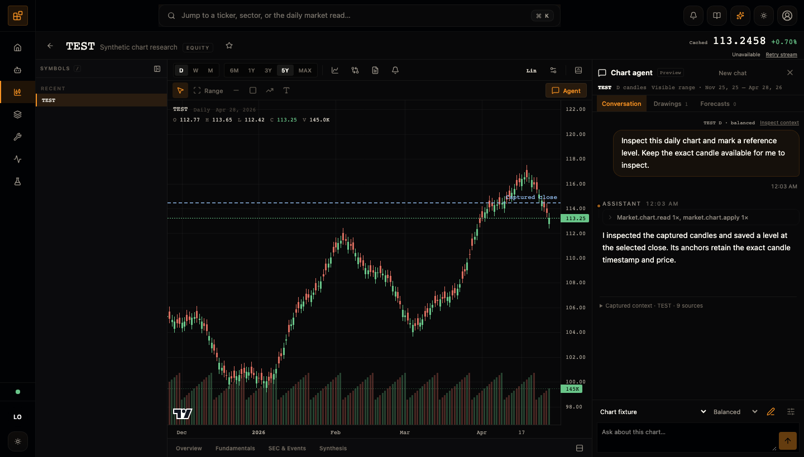
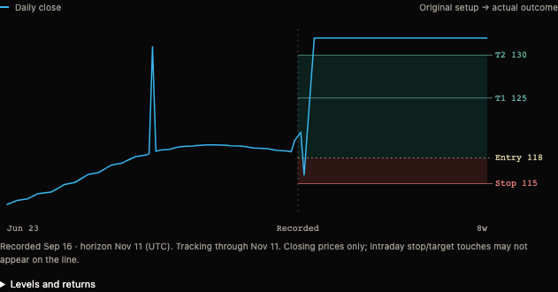

# CopeNet

**Your charts. Your agents. A record of what happens next.**



*Chart-agent demo with synthetic prices and a scripted model response, running through the real tool and drawing system.*

CopeNet is a self-hosted **AI market research workstation**, built on a multi-provider agent harness. Study a chart with an agent beside you, inspect the data behind its answer, let it draw a setup, and track a forecast against later prices.

It started as a harness for local models. Today, Market is the main focus, with OpenAI Codex, Claude, and local runtimes sharing a platform for persistent conversations, tools, and inspectable runs.

[Get started](#get-started) · [Explore the platform](docs/PRODUCT-TOUR.md) · [Architecture](docs/ARCHITECTURE.md) · [Current limits](#current-status)

## An agent that works with your chart

The chart agent receives **the data behind the view**: captured candles, indicator values, drawings, and supported research panels. Every message freezes that context, so you can inspect what the model actually had available for its answer.

- **Ask about a period.** Use the visible range, drag across candles, or tap a start and end. The selection spans price and indicator panes.
- **Draw together.** Agents can add levels, zones, trendlines, and labels with evidence references. You can edit, hide, delete, and undo drawings; manual edits protect them from later agent changes.
- **Control the detail.** Quick, Balanced, and Deep adjust the initial context and read budgets. Numeric tables use CSV with source metadata, while exact captured data remains available through scoped tools.
- **Check the work.** Open **Inspect context** to review captured sources and tool activity. Account panels are excluded from new chart captures by default.

## Turn a setup into a tracked experiment



*Synthetic example: the line shows completed daily closes. Intraday stop or target touches may not appear on that line.*

Choose **Forecast this chart** to have a model propose an entry, stop, targets, and a thesis from frozen evidence. The original setup stays fixed. Its chart leaves future space empty until observed prices arrive, then shows how the experiment unfolded.

Completed daily candles track simulated fills and outcomes without more model calls. The Ledger separates trade results from four/eight-week direction: a later recovery does not erase a stop-out. Optional independent directional runs let you compare the two approaches on the same chart evidence.

These are **manual research experiments**, not brokerage orders or evidence of a proven trading edge. [Forecast behavior and evaluation limits →](docs/initiatives/chart-forecasts/STATUS.md)

<details>
<summary>See forecast overlays, the Ledger, and the mobile companion</summary>


*These captures use synthetic demonstration data. On phones, chart and conversation switch between full-width views.*

</details>

## A market workspace around the conversation

Charts sit alongside watchlists, sector rotation, SEC filings, financial statements, and model reads. Explore a ticker's fundamentals, overlay revenue or historical P/E, compare assets and formulas, and create scans and technical alerts.


*Financial explorer capture. Some gallery images show earlier workspace chrome.*

Financial overlays use the date information became public. Model reads retain evidence and falsification conditions, and the forward Ledger records calls for later evaluation. Market data comes primarily from yfinance and [CopeTech-Edgar](https://github.com/pattty847/CopeTech-Edgar); freshness and coverage are visible parts of the workflow.

[Market tools, scans, formulas, and more screenshots →](docs/PRODUCT-TOUR.md#market-workspace)

## A full agent harness underneath

The **Agents** workspace also supports general conversations and tool-driven work. Sessions retain transcripts and artifacts; runs record the provider, model, and tool activity. Profiles, personas, memory, and explicit Access controls shape how an agent works.

**Fleet rooms** let OpenAI and Claude answer from the same room snapshot independently before revealing their responses. **Observability** lets you inspect run history, tool results, and captured model inputs when debug capture was enabled.

<details>
<summary>Inside Fleet and the run inspector</summary>


</details>

| Provider | Connection |
| --- | --- |
| OpenAI Codex | CopeNet OAuth login (`openai-codex`) |
| Claude | Installed, authenticated Claude Code CLI (`claude-cli`) |
| Codex CLI | Installed, authenticated Codex CLI (`codex-cli`) |
| LM Studio | Local HTTP server (`lm-studio`) |
| Ollama | Local daemon (`ollama`) |

Tool capabilities depend on the provider and model. Running the app locally does not make cloud-provider requests local.

## Get started

You need **Python 3.12+**, [uv](https://docs.astral.sh/uv/), **Node.js 22+ with npm**, Git, and one configured model provider.

The current checkout uses CopeTech-Edgar as an editable sibling dependency. Clone both repositories into the same parent directory:

```bash
git clone https://github.com/pattty847/CopeTech-Edgar.git
git clone https://github.com/pattty847/CopeNet.git
cd CopeNet

npm --prefix src/copenet/host/frontend ci
npm --prefix src/copenet/host/frontend run build
uv sync
```

For the OpenAI Codex provider, authenticate once:

```bash
uv run copenet auth login --provider openai-codex
```

Or use an authenticated CLI / running local runtime from the table above. Then start the app:

```bash
uv run copenet
```

Open **http://127.0.0.1:17123**. In **Market**, open a ticker, wait for its chart data, and select **Agent**. Choose your provider/model and try: *“Explain the recent price action and mark a level worth watching.”* Available chart tools depend on that runtime's capabilities.

The frontend build also creates the indicator evaluator used by background technical alerts; keep Node.js available when running the host.

[Full startup guide and private mobile access](docs/STARTUP.md) · [Optional calendar and read-only Webull setup](docs/INTEGRATIONS.md)

## Current status

CopeNet is actively developed and used by its creator. Chart agents and forecasts are preview features. The current forecast evaluator uses completed daily US-equity/ETF candles, with explicit handling for ambiguous price paths; results exclude trading costs and liquidity simulation. Tracking depends on the running host and fresh cached prices.

Live crypto/order-book integration is future work. Workflows and Data & Tools are still direction-setting sections; they are not the reason to install CopeNet today.

The project grew out of an interest in markets, visual tools, and agents that can work inside them. The aim is a workspace worth opening every day, with enough visibility to question the model's conclusions.

## Build with it

The backend is Python/FastAPI; the workspace is React/TypeScript with Lightweight Charts. Shared harness and business logic live in `src/copenet/core/`, with provider adapters kept separate. External applications can connect through WebSocket RPC or the REST + SSE API.

- [Product tour](docs/PRODUCT-TOUR.md) — more of the Market and agent workspace
- [Architecture](docs/ARCHITECTURE.md) · [App API](docs/APP-API.md) · [Session semantics](docs/SESSION-CONTINUITY.md)
- [Chart-agent context and tools](docs/initiatives/chart-agent/CONTEXT_AND_TOOLS.md) — how to expose new features to agents
- [Knowledge bases](docs/KNOWLEDGE-BASES.md) — bring your own local sources
- [Testing](docs/TESTING.md) · [Debugging](docs/DEBUGGING.md) · [Tracing](docs/TRACING.md)
- [Contributor guide](AGENTS.md)

Useful feedback: which chart you were studying, what you asked, what the agent saw, and where the result helped or fell short. Remove private account data and credentials before sharing a report.
