# CopeNet


CopeNet is a *continuity engine* agent operator for people who want more than a chat box. It gives you a persistent workspace for running local and CLI-backed models, inspecting what they actually did, and turning useful sessions into repeatable workflows.

> **Meet the Custodian** — badge says `ACCESS EVERYWHERE`, patch says `DON'T WRITE. DELETE.` He's got the keys to every session, a rubber duck for the hard bugs, and a mop that's seen things. He keeps the transcripts append-only and the worktrees swept. The harness is the building; he's the night shift.

<br clear="right" />


## Product Tour

The shared app shell uses an edge-to-edge workspace with a narrow navigation rail,
square outer edges, and thin section borders. Market panels meet the shell directly,
without an inset rounded container or surrounding gutters.

### Home Dashboard — workspace overview and operator launchpad
The Home dashboard is the front door to CopeNet: the operator console with live workspace signal (active sessions, provider health, tools available), recent activity, system health, quick-start actions, and an ambient NASA *Picture of the Day* to orient you when you sit back down.

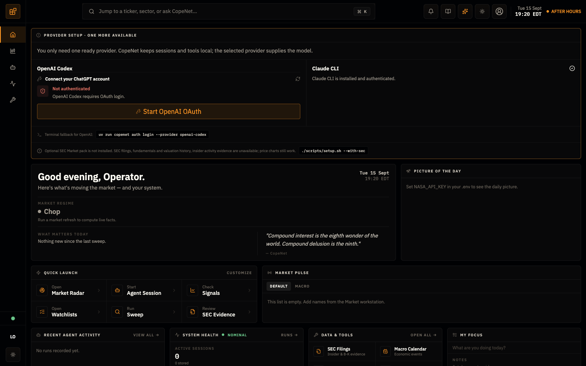

### Agents Console — persistent sessions with inspectable runtime context
The Agents view keeps the live conversation and runtime inspector together so a run stays understandable instead of turning into opaque chat history. Operators can attach one or more tools to the next message as removable chips: the visible message stays clean while the structured tool request is carried into that turn and preserved as transcript metadata. The session menu keeps conversation handling explicit too: copy messages only, copy messages with tool activity, export the full chat and tools as Markdown, or create a separate debug session. The inspector on the right keeps the session provider, model, Access, persona, and recent activity visible.

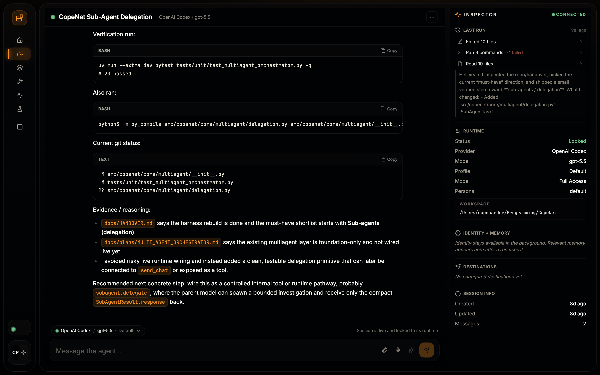
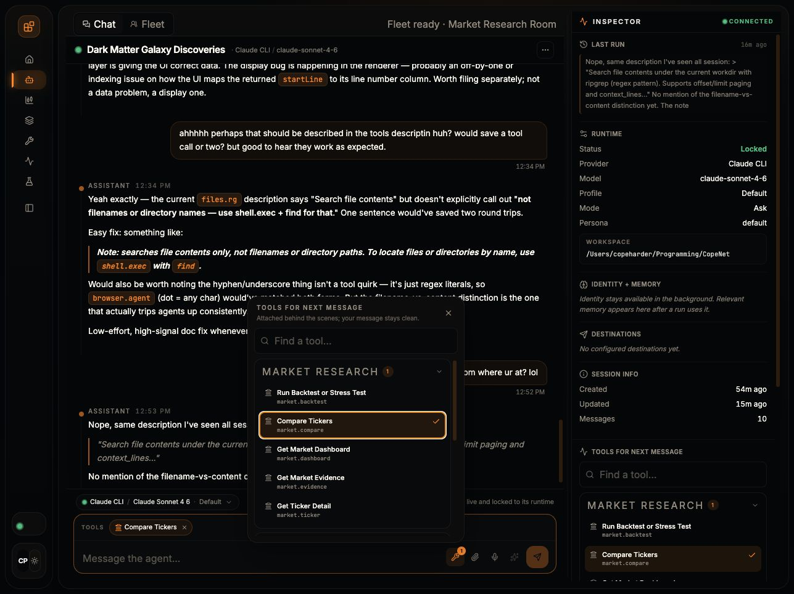

### Fleet Rooms — ChatGPT and Claude collaborate without agreement theater
Fleet is a durable multi-model room inside Agents. An `@everyone` prompt runs ChatGPT and Claude from the same room snapshot behind an independent-first reveal barrier, then commits both answers with attributed tool receipts. Follow up with `@chatgpt` or `@claude` to challenge a claim directly; each provider keeps its own resumable lane while the room remains the product-visible source of truth.

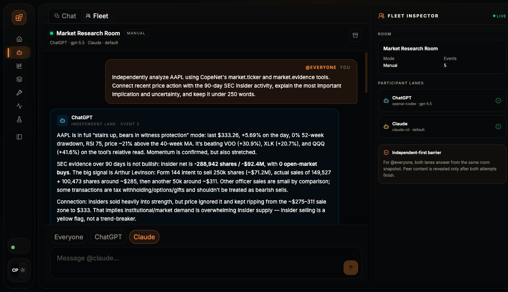

### Workflows — purpose-built operator surfaces beyond a single chat
The Workflows section is where CopeNet starts feeling like an operator studio instead of a prompt box: focused workflow entrypoints, scoped task surfaces, and room for productized agent behaviors that deserve more than one conversation pane.

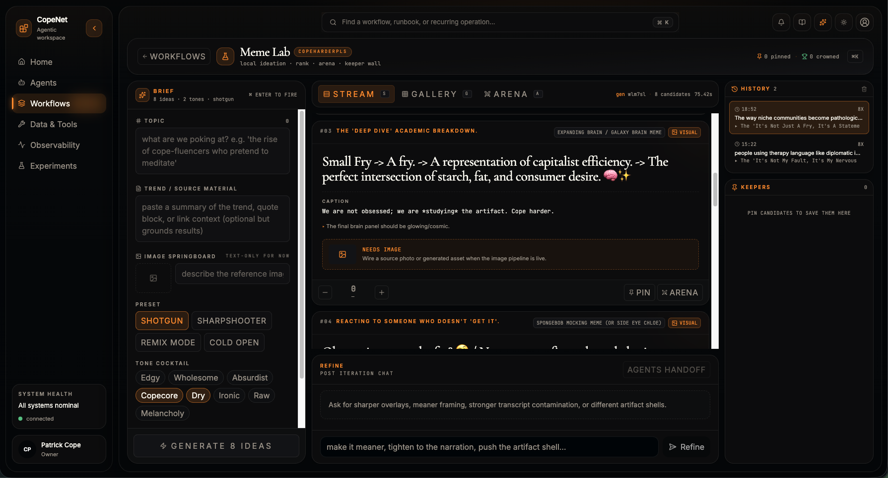

### Data & Tools — the workspace plumbing that keeps runs useful
Data & Tools gathers the practical substrate around the agent: imported assets, source material, tool surfaces, and the structured inputs that make later runs more reusable and less ad hoc.

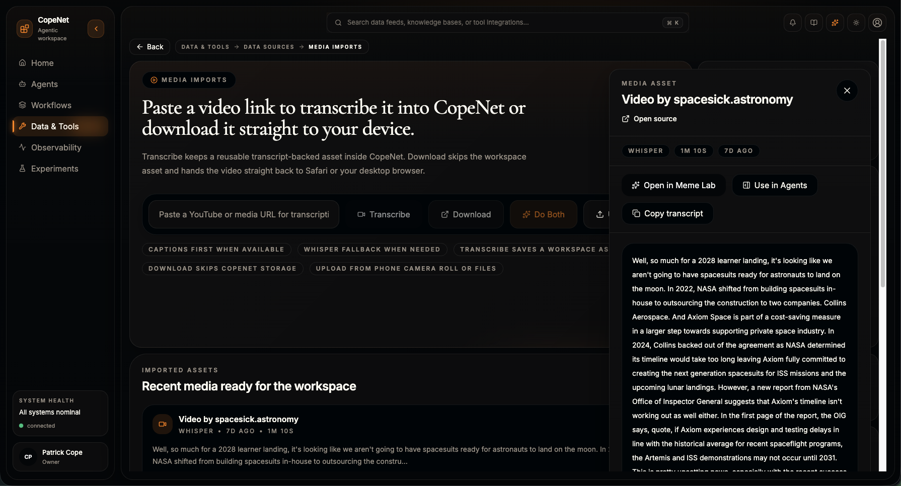

### Persona Home — give CopeNet a stable self, per model
Persona Home makes identity explicit and editable instead of spooky. Pick or create a persona, switch the active one per runtime, and edit the underlying identity files (`SOUL.md`, `IDENTITY.md`, `USER.md`, …) right in the inline editor. The model can even author a whole persona on request — just ask it to build one and it fills the files itself. Personas live in a plain folder of markdown you fully control.

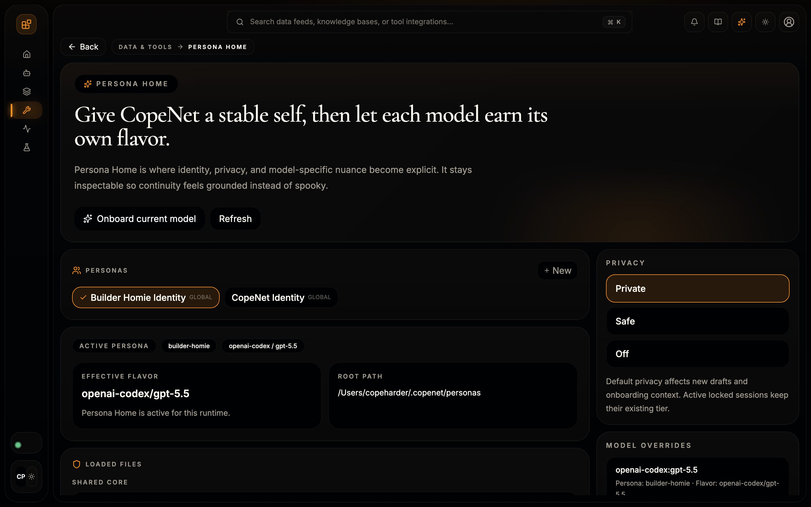

### Observability — trace the work, not just the answer
The Observability run inspector reconstructs each model turn from durable evidence: the effective model input, provider/model metadata, reasoning summaries with honest provenance, exact tool arguments and retained results, the final response, and the raw JSONL trace. A persisted **Debug capture** switch enables the sensitive prompt/tool snapshot for subsequent local runs without requiring a host restart.

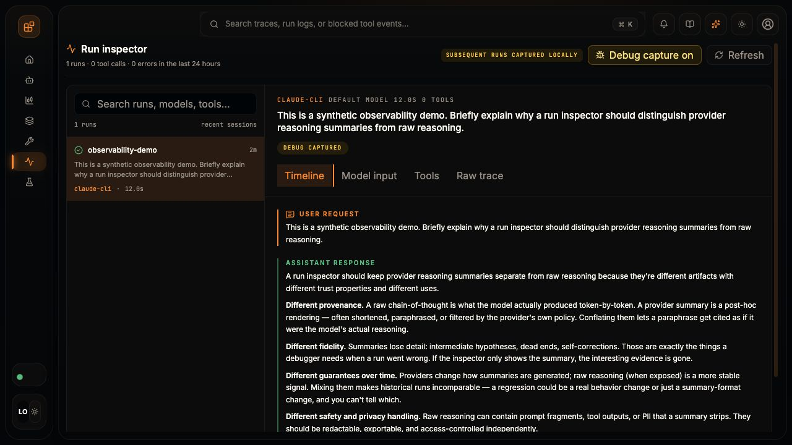

### Experiments Matrix — compare behavior across providers and models
Experiments makes evaluation legible by surfacing provider × model runs in one place, making it easier to compare speed, tool behavior, and prompt-following drift.

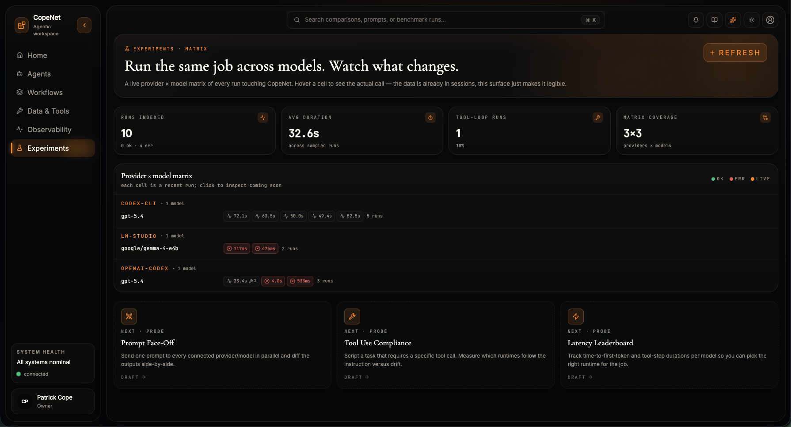

### Access & Permissions — operator-grade trust, not all-or-nothing
Permissions are their own axis, separate from behavior. Every session picks an **Access** level — **Read-only** (reads + a safe shell allowlist), **Ask** (anything off-allowlist pauses for your approval instead of silently failing), or **Full Access** (writes + unrestricted shell, gated to trusted frontier providers). When a command pauses, the approval card surfaces inline — on desktop *and* mobile — with **Approve**, **Reject**, or **Always allow**. "Always allow" writes the command to a global, persisted allowlist you can edit any time, so the things you trust stop nagging you. Access (and the model, same provider) can even change mid-session, while every run stays stamped with exactly what it used.

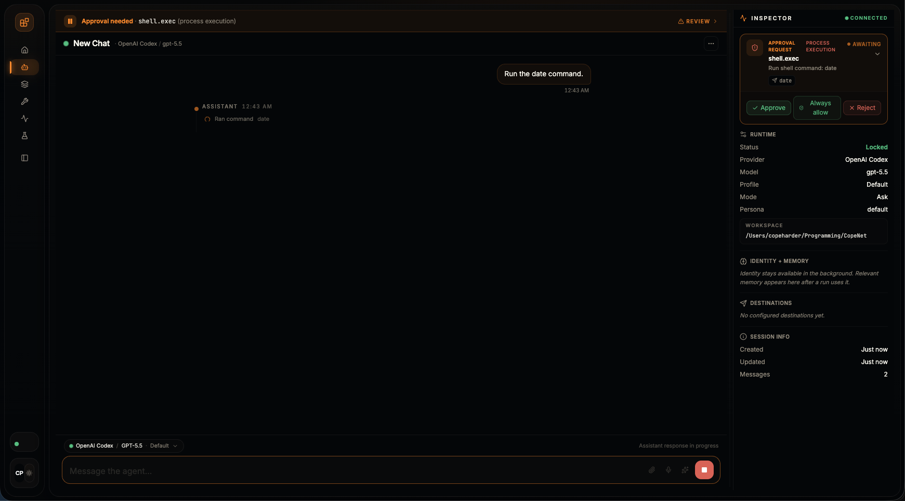

### Market Monitor — a daily brief, not a wall of tickers
Market Monitor is the current favorite: a 60-second morning brief on your watchlist, backed by live SEC filings (Form 4, Form 144, 8-K), sector rotation (RRG), an accumulation watch, and a model-generated daily read that shows its work — regime call, evidence considered, and "what would make this wrong" laid out explicitly instead of buried in a chat reply. Every claim the model makes gets logged to a forward ledger and scored later, so the read is accountable, not just confident.

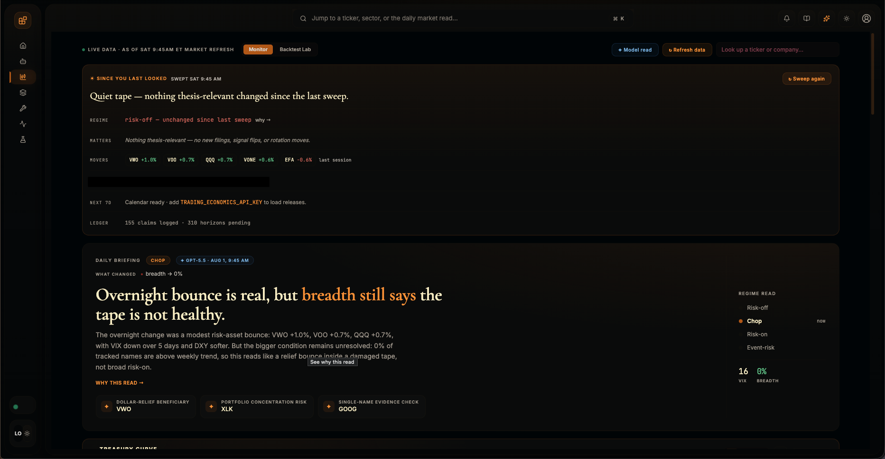

Market and ticker share a quiet loading treatment: workspace-shaped outlines, one
status label, and a thin orange sweep (static with reduced motion). Navigation stays
usable, desktop panel preferences remain intact, and ready data appears immediately.
Startup never substitutes a demo dashboard. Empty results and connection failures
have distinct states; background refresh failures retain the last real snapshot.

<details>
<summary>Workspace loading states (isolated synthetic previews)</summary>

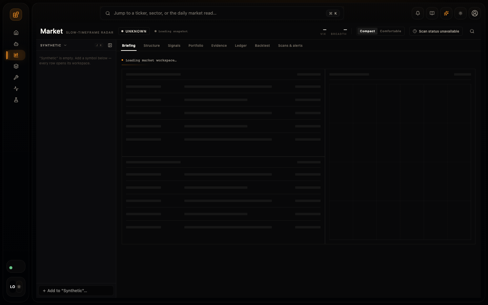
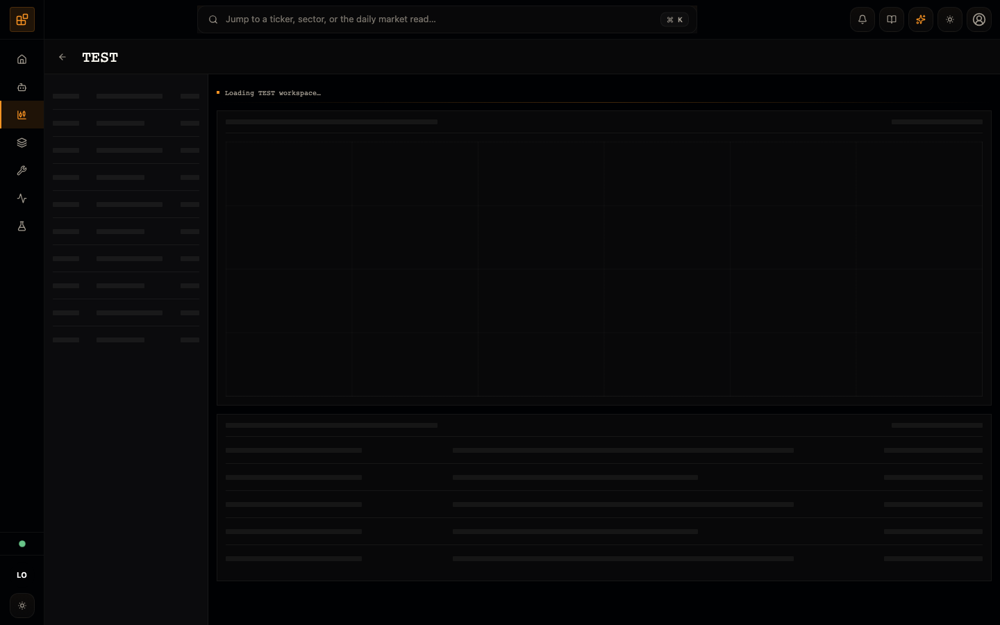

</details>

**Scans & alerts** — named asset baskets, linked watchlists, exclusions, source selection,
and multiple timezone-aware schedules live in one Market workspace. The morning default
is **09:45**; missed times are skipped, never caught up at startup. Preview exact inclusion
reasons and cached/source work before an explicit run. Focused scans keep separate results;
they do not replace the broad-market briefing.

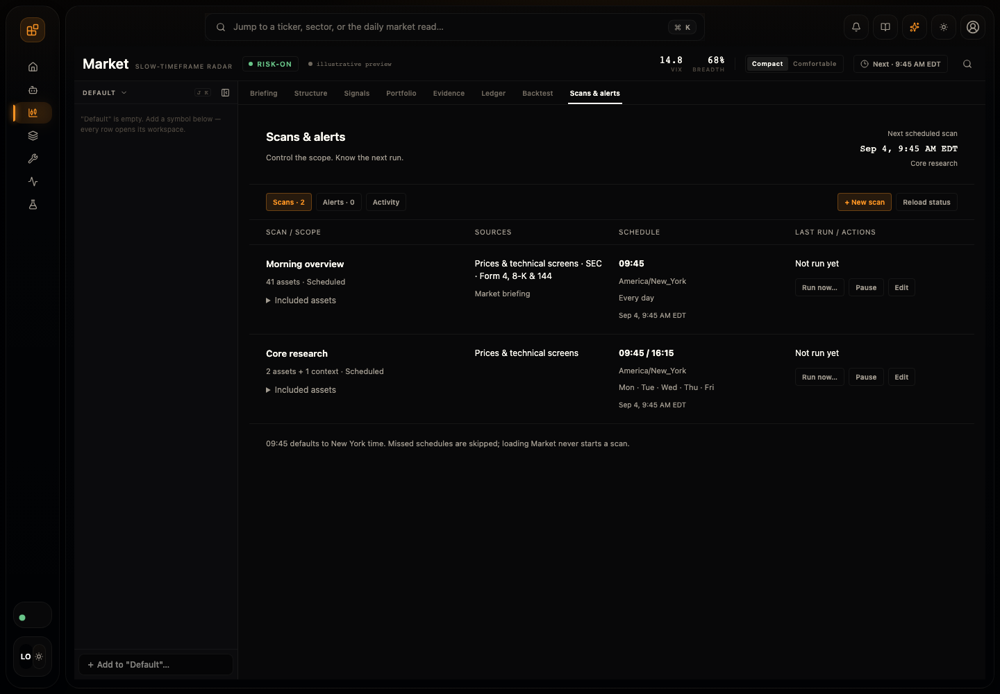

Technical alerts use the chart’s own price/SMA/EMA/RSI/MACD calculations on completed
daily, weekly, or monthly US-equity candles. Arming establishes a baseline, not an old
crossing. Rules can repeat or stop after one event. Every crossing is recorded in Pulse;
optional Telegram delivery has per-rule consent, approval, receipts, retry, and explicit
uncertain-send handling. An indicator’s bell carries its current settings into the editor.

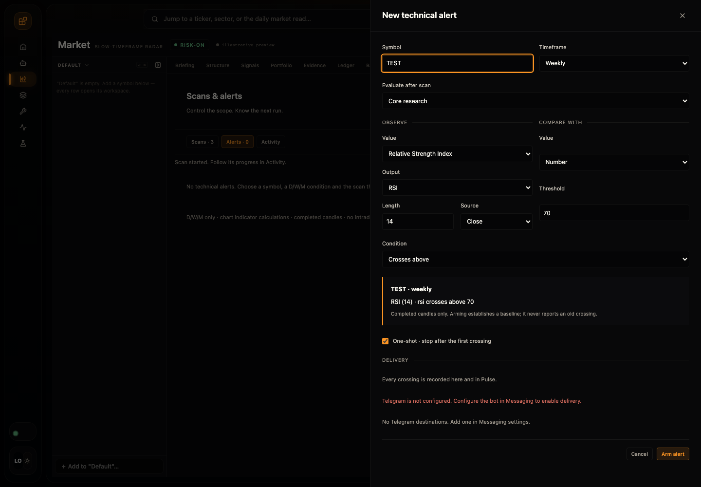

Build the frontend with `npm run build` before running the host: it also produces the
headless indicator evaluator. **Node.js is required by background technical alerts.**
Telegram uses the existing `COPNET_TELEGRAM_BOT_TOKEN` and configured Messaging
destinations. Optionally set `COPNET_PUBLIC_URL` to a private, device-reachable origin for
ticker links; never put credentials in that URL. Use Activity’s explicit test-message action
to verify real delivery. No message is sent just by opening these controls.

On mobile, the Market workstation uses section tabs and a fixed, stacked layout: every
widget stays accessible, while your desktop arrangement remains saved separately. Lists
flow with the section instead of trapping vertical scrolling; wide financial tables scroll
sideways. RRG scrolling moves the page by default, with explicit zoom controls and an
opt-in touch-pan mode.

<details>
<summary>Mobile Signals workspace (synthetic demonstration data)</summary>

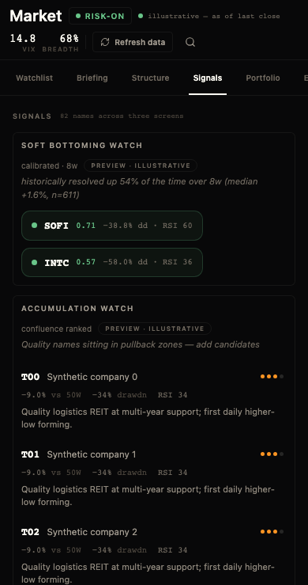

</details>

**Asset workspace** — every ticker opens as a reloadable `/market/{symbol}` research
surface with the price chart in command. Identity, quote provenance, watchlist state,
asset switching, interval and visible-range controls, split-adjusted price history,
SEC markers, financial overlays, and alerts stay in one compact instrument frame. A
thin context strip answers why the asset matters now, while a persistent research dock
separates measured state, SEC evidence, and model synthesis without making them compete
with the chart. Fundamentals become a linked chart-and-table explorer for income, cash
flow, margins, balance-sheet, per-share, and valuation stories; every period keeps its
source filing one click away. SEC activity adds a signed transaction-size history that
keeps executed Form 4 trades separate from planned Form 144 sales and can filter the
evidence list to a filing day. Portfolio context appears only when a position actually
exists.

The benchmark check labels **Beats/Lags** from aligned trailing-52-week excess return,
then exposes asset return, benchmark return, beta, and the beta-adjusted residual as
separate facts. SEC chart settings keep 8-K and Form 144 events visible while Form 4
transactions start off, with operator-selected lookback and cluster-box display by
default; individual trades remain available for inspection. Linear/log axis mode is an
explicit toolbar control.

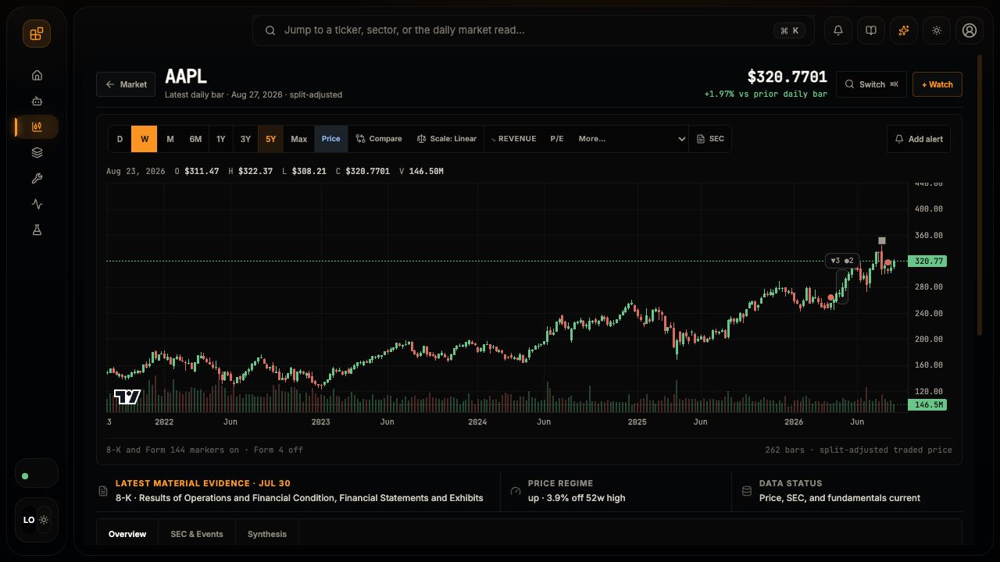

**Chart agent preview** — open **Agent** beside the ticker chart to ask about its
actual candles, plotted indicators, quote and research panels. Every send freezes those
render inputs into an immutable observation. Quick, Balanced and Deep adjust the initial
context and exact-read budgets while retaining the complete captured source data.
Numeric candle and indicator tables reach the model as CSV with source and coverage
metadata; stored evidence and inspector artifacts keep their structured rows.

The companion uses ordinary CopeNet sessions and scoped chart tools. Agents can create
levels, zones, trendlines and labels with evidence links; you can select, edit, hide,
delete or undo them. Compact chat spacing and a short assistant marker leave more room
for research, with per-turn **Inspect context** access. Manual edits protect an object
from later agent changes. Drawing
revisions persist across reloads, and a paint receipt distinguishes saved work from
what is visible. Account panel data is excluded by default; prior conversation, drawings
and profile context remain. Crypto/order-book feeds and proactive commentary are later
adapters. See the [demo guide and verification record](docs/initiatives/chart-agent/DEMO.md).

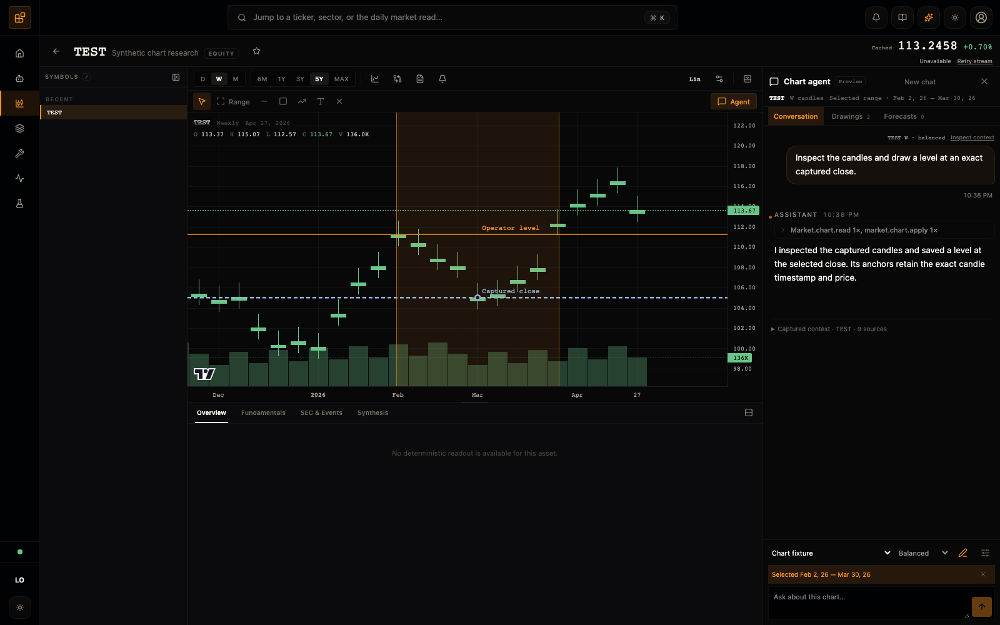

**Chart forecasts** — choose **Forecast this chart** in the companion settings to
manually register a setup for one ticker. The model submits an entry, fixed stop,
fractional profit targets and explanatory zones from frozen chart evidence. Published
levels remain immutable and separate from editable drawings. Completed daily candles
track simulated fills, ambiguous paths and four/eight-week directional outcomes without
additional model calls. An optional independent directional run enables paired comparison
in **Ledger → Comparison**; historical calls retain their original scoring rules.
The offline browser example verifies a stopped trade and an ambiguous, unscored trade
whose eight-week directional calls both succeed; later recovery never erases a stop-out.

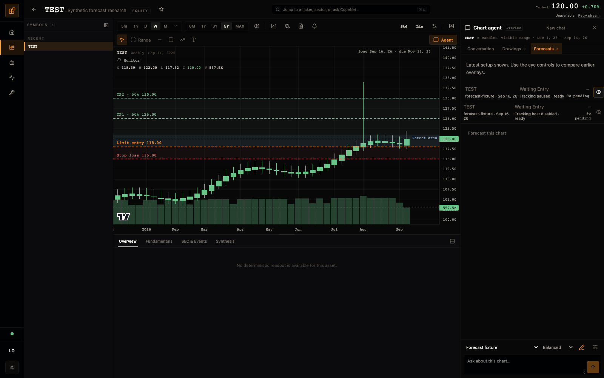

<details>
<summary>Forecasts on mobile and Ledger comparison (synthetic demonstration data)</summary>

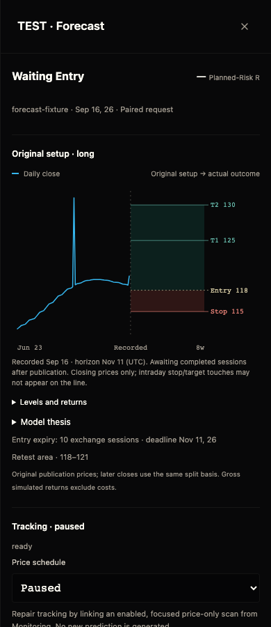

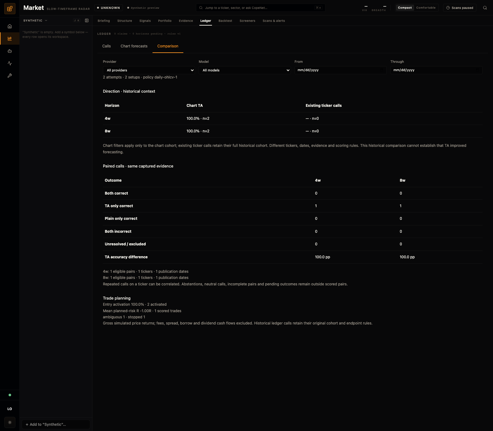

</details>

On phones, chart and companion switch between full-width views. Pinch zoom keeps its
chosen time range through viewport updates and background document refreshes.
The compact composer keeps model, detail and drawing controls on one row, with provider
and account-context options in a settings popover and Send/Stop beside the message field.

<details>
<summary>Mobile companion and chart zoom (synthetic demonstration data)</summary>

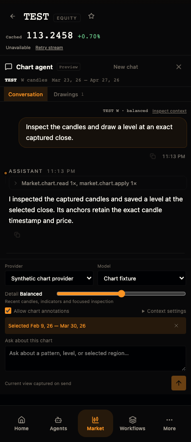

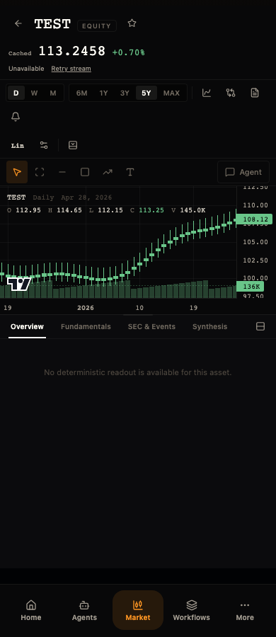

</details>

**View-scoped live quote** — opening one ticker subscribes to Yahoo's price stream;
the asset bar shows last price, vendor time, session and reported day volume. Leaving
the ticker or hiding the browser tab closes the subscription. Switching assets closes
the old stream first; returning opens only the current asset. Quotes may be delayed,
and missing volume stays unknown. This ephemeral readout never rewrites historical
candles, evaluates completed-candle alerts, or triggers a scan. Each connected browser
has at most one upstream ticker subscription, with a 75-second expiry for abandoned views.

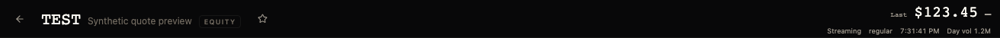

**Formula symbols** — type an expression such as `VOO/GLD`, `(VOO + GLD) / 2`, or
`0.6 * VOO + 0.4 * TLT` into the Market search or the ticker workspace's `/` jump.
Yahoo Finance assistance follows the operand being typed, while a distinct Formula
Symbol result opens a reloadable synthetic chart. The safe expression grammar supports
numbers, parentheses, and `+`, `-`, `*`, and `/`; it evaluates split-adjusted closes on
shared timestamps and never fabricates candles or attaches issuer-only evidence to a
synthetic series. The chart can show the formula's value or rebase it to indexed percent.

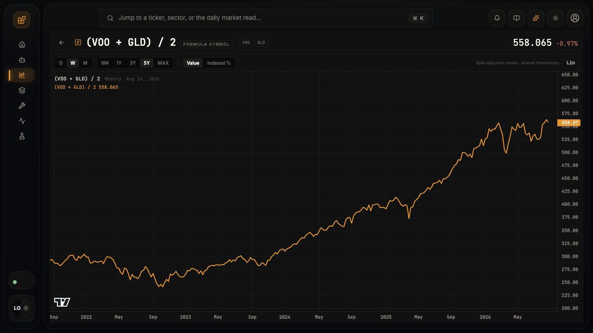

**Multi-series and formula comparison** — switch an asset chart from traded price to an
indexed comparison and add up to five symbols or full formulas. Compare uses the same
backend parser and price-history basis as the Formula Symbol workspace. Every line is
rebased to zero at the selected range's first usable observation and persisted in the URL
for reloads and sharing, so ordinary symbols, ratios, weighted baskets, and spreads can be
examined together without mixing raw values and percentages on one axis.

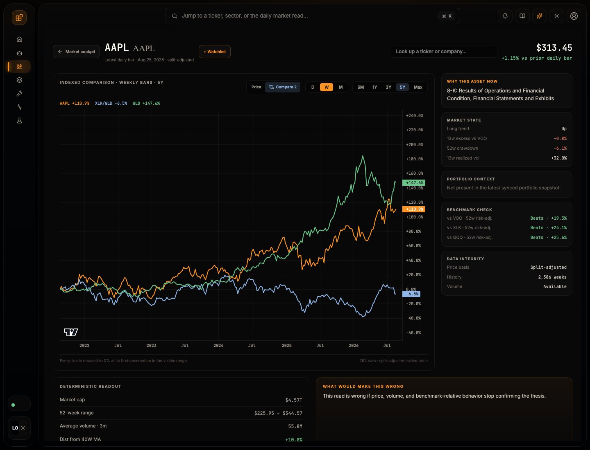

**Chart-created price alerts** — click **Add alert**, place a level directly on the
candlestick chart, and choose whether a daily close should cross above or below it.
The picked level immediately appears as a labeled draft line and stays in the popup for
review before it is armed. Rules are durable and one-shot; active levels return as chart
lines. Evaluation follows the linked price scan and creates a Pulse item on a completed
daily-candle crossing. Manage timeframe, scan, repeating behavior, and Telegram delivery
in Scans & alerts. Intraday alerts remain out of scope.

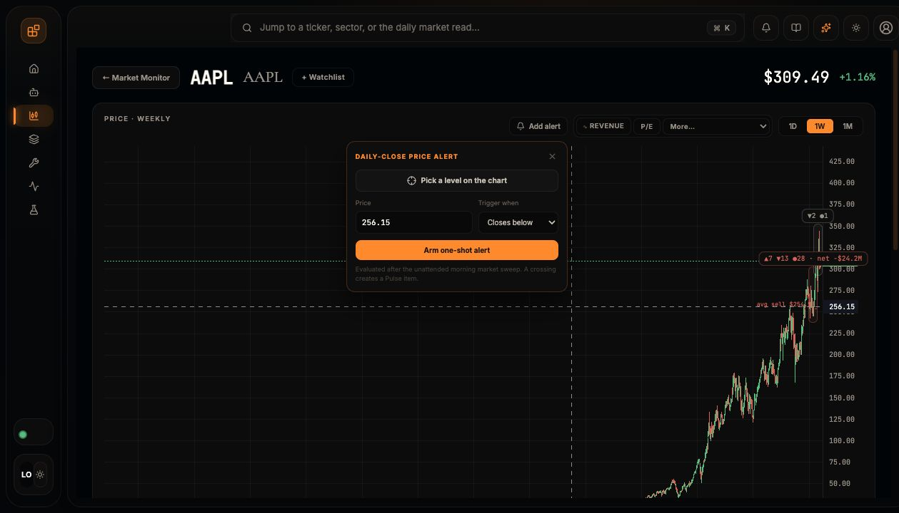

Chart interval, range, and axis mode lead a compact TradingView-style instrument strip;
joined cells replace a row of separated pills, and analysis tools follow in the same
rail. The available width stays with the chart on desktop and phones: the tool rail
scrolls horizontally, exposes edge nudges only when more tools exist, and keeps a thin
scrollbar for discoverability. Alert creation opens as a phone-width sheet instead of
overflowing the chart edge.

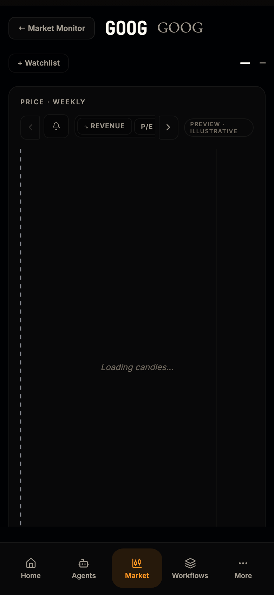

**Financial-series overlays** — ticker charts can layer quarterly,
trailing-twelve-month, or annual revenue over split-adjusted price, plus historical
P/E built from the price and the TTM diluted EPS that was actually public on each
date. The open-source SEC pipeline stitches issuer concept changes, derives missing
revenue fourth quarters, reconstructs interim EPS from weighted diluted shares,
preserves accession-level provenance, and applies amendments only after their filing
date. P/E stays blank when earnings are non-positive, stale, or unsupported; the
chart renders those intervals as real gaps and keeps its financial scale on the left.

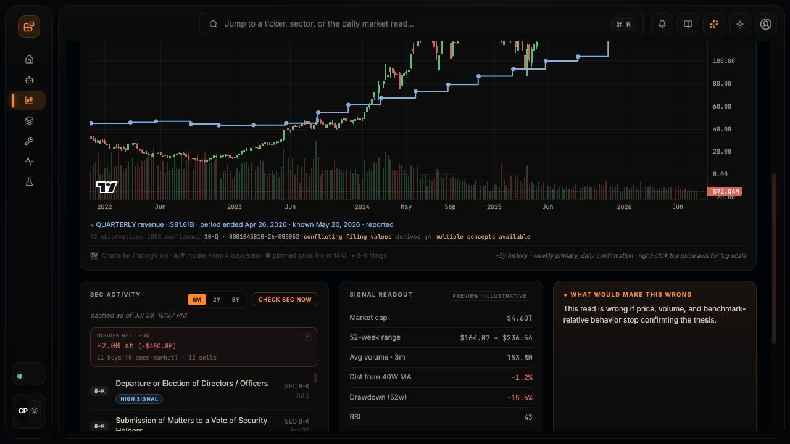
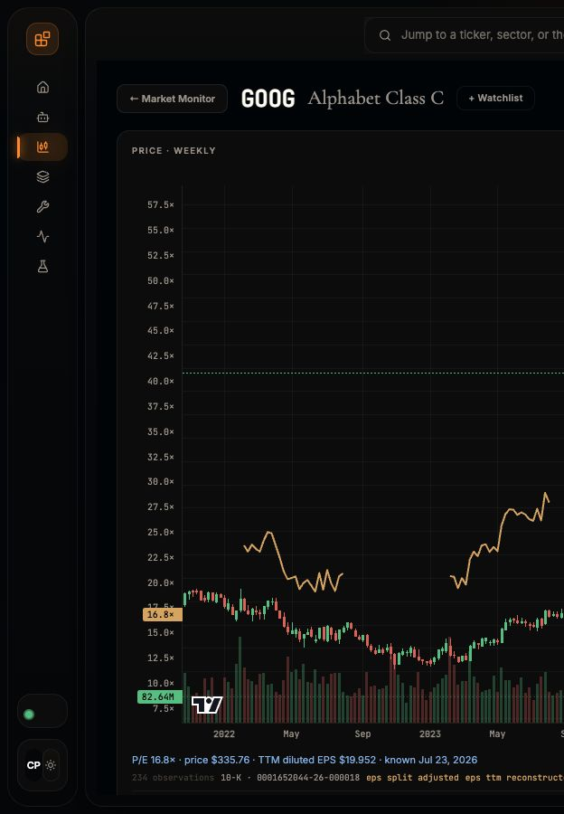

**Treasury curve** — official U.S. Treasury Constant Maturity rates for the 3M, 2Y, 5Y, 10Y, and 30Y benchmarks, with selectable basis-point moves, curve-shape context, and the key 10Y–2Y and 10Y–3M spreads. The feed is cached for 15 minutes and every plotted tenor is aligned to the same Treasury observation date.

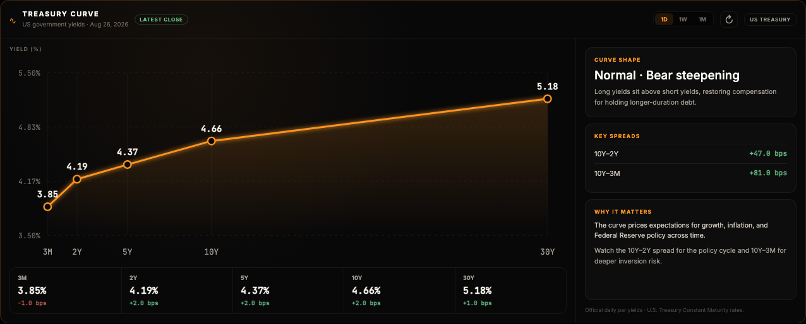

<details>
<summary>More Market Monitor views — why-this-read drill-down, watchlist, sector rotation, forward ledger</summary>

**Why this read** — every model call expands into its reasoning: regime inputs, evidence considered (with SEC filing citations), and explicit falsification conditions.

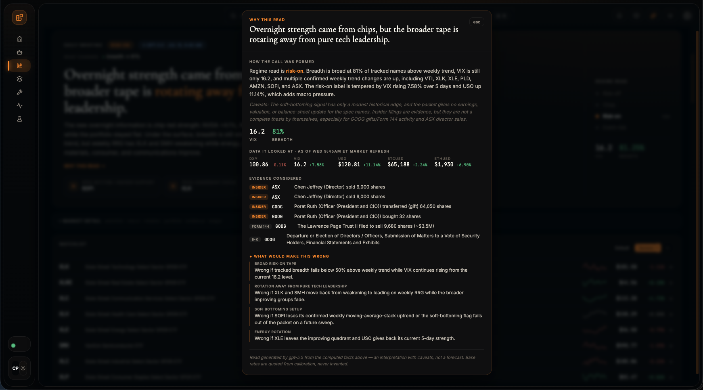

**Watchlist + macro board** — sector ETFs, custom watchlists, and a macro weather strip (DXY, VIX, oil, BTC, ETH) at a glance.

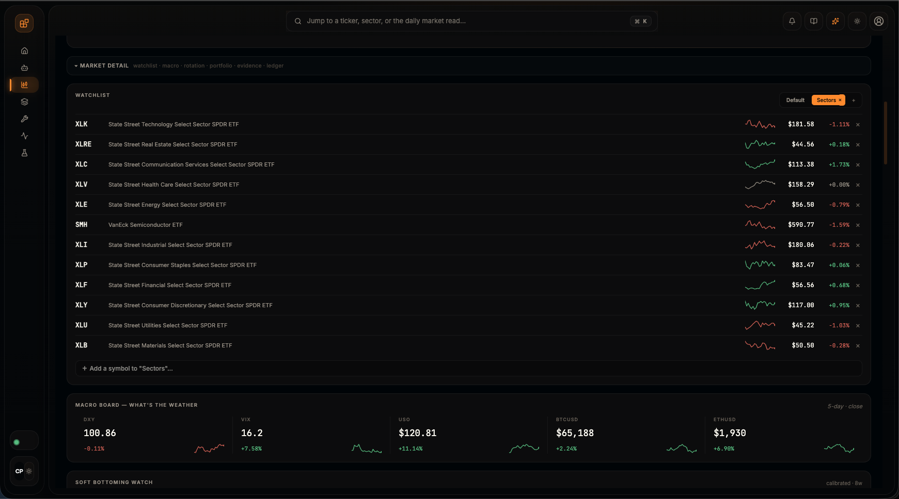

**Sector rotation (RRG) + accumulation watch** — relative-strength rotation quadrants and a confluence-ranked list of names sitting in pullback zones.

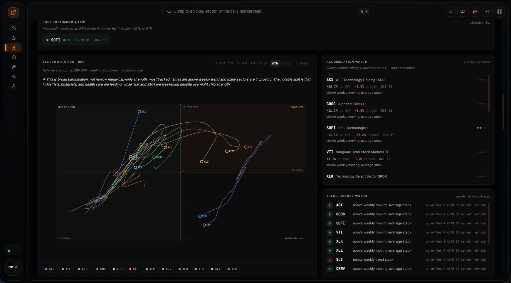

**Forward ledger + evidence/contrarian** — every regime and ticker call is pre-registered and scored at 4w/8w, no backfilling; a dedicated panel argues the other side of every highlighted signal.

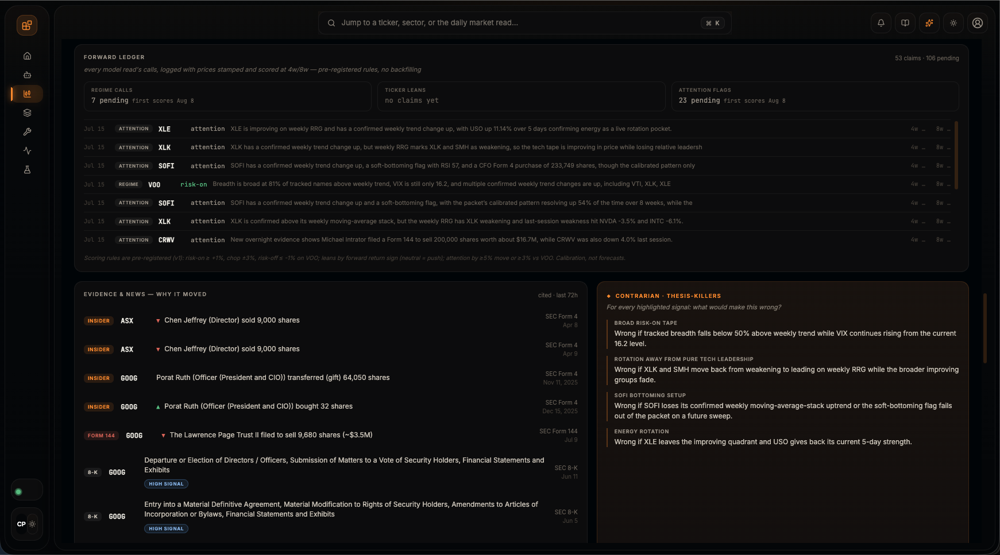

</details>

## Why CopeNet

CopeNet started as a local-only project — small models on-device, no cloud dependency. That fell apart fast: small local models can't reliably plan multi-step tool use or hold an operator workflow together, so CopeNet grew a CLI-backed and subscription-backed provider layer (`codex-cli`, `claude-cli`, `openai-codex`) alongside the local runtimes. Local-first is still the default posture — sessions, transcripts, and control stay on your machine — but the models doing the actual reasoning are frontier-capable now.

Most local AI tools stop at “send a prompt, get a reply.” CopeNet is built for the workflows that happen after that:

- **Operate locally**: keep models, transcripts, and sensitive context close to your machine
- **Inspect runs**: see traces, tool activity, runtime drift, and session state instead of guessing
- **Reuse workflows**: move from one-off chats to repeatable operator surfaces
- **Compare runtimes**: lock sessions to provider/model combinations so behavior stays explainable
- **Extend without cloud lock-in**: add prompts, tools, workflows, and knowledge sources without giving up local control

## What You Can Do

CopeNet is evolving into an operator workspace, not just a chat client. Today it already supports:

- **Agent sessions** with persistent transcripts, first-send runtime binding (provider/profile lock; model + Access changeable mid-session), archive/restore, and inline tool execution
- **Fleet rooms** where ChatGPT and Claude independently research the same question, share evidence receipts after reveal, and critique each other in attributed follow-up turns
- **Observability** with a per-run timeline, provider reasoning provenance, exact tool evidence, model-input snapshots, and raw local traces
- **Workflow surfaces** such as `Meme Lab`, built on top of a stateless ideation API for structured local-model generation
- **Media imports** for transcription and download-first workflows, including mobile-friendly remote use over Tailscale
- **Experiments** for comparing provider/model behavior across real runs
- **Profile + Access layering**: behavioral Profiles (markdown presets) plus a separate **Read-only · Ask · Full Access** permission axis with operator approvals and a persisted shell allowlist
- **Market Monitor**: a daily model-generated brief backed by live SEC filings, sector rotation, and a pre-registered forward ledger that scores its own calls

## Providers

CopeNet currently supports local, CLI-backed, and subscription-backed runtimes through a shared harness:

- `codex-cli` — local Codex CLI subprocess
- `claude-cli` — local `claude` CLI subprocess
- `openai-codex` — OpenAI Codex via OAuth (`uv run copenet auth login --provider openai-codex`)
- `lm-studio` — local LM Studio HTTP server
- `ollama` — local Ollama daemon

The goal is provider-agnostic operator tooling: one workspace, multiple runtimes, consistent session semantics. See [`docs/CAPABILITY-MATRIX.md`](docs/CAPABILITY-MATRIX.md) for tool-loop and feature support per provider.

## Quickstart

### 1) Prerequisites

- Python 3.11+
- [`uv`](https://docs.astral.sh/uv/)
- Optional local runtimes:
  - Ollama running on `http://127.0.0.1:11434`
  - LM Studio local server on `http://127.0.0.1:1234`
- Optional CLI runtimes:
  - Codex CLI installed and authenticated (for `codex-cli`)
  - Claude CLI on PATH (for `claude-cli`)
- Optional subscription-backed runtime:
  - OpenAI Codex OAuth via `uv run copenet auth login --provider openai-codex`

### 2) Install dependencies

```bash
uv sync
```

### 3) Run CopeNet

```bash
uv run copenet
```

Open the desktop UI at:

- `http://127.0.0.1:17123`

### 4) Optional: open it remotely on your own devices

CopeNet also works well over your tailnet for private mobile access:

```bash
# One-time setup: keep a random token in the dedicated, gitignored host env file.
umask 077
printf 'COPNET_TOKEN="%s"\nCOPNET_PORT=17123\n' \
  "$(python3 -c 'import secrets; print(secrets.token_urlsafe(32))')" > .copenet.env

# Launch on this Mac's Tailscale IPv4 only (not every local network interface).
COPNET_HOST=tailscale uv run --env-file .copenet.env copenet
```

Then open it from another device using your Tailscale hostname or tailnet IP. When
the authentication banner appears, enter the same token once; CopeNet stores it
only in that browser and reuses it on later visits. Do not embed the token in a
shared URL.

## Local Setup Notes

1. Start your local runtimes first (Ollama and/or LM Studio).
2. Run `uv run copenet`.
3. Open the UI and create a new session.
4. Pick provider, model, profile, and Access.
5. Send the first message to create the session and lock provider/profile/persona/workspace.

The operator may change model within the same provider and may change Access on later
runs. Start a new chat for another provider, profile, persona, or workspace.

## Configuration

Environment variables:

- `COPNET_HOST` (default: `127.0.0.1`)
- `COPNET_PORT` (default: `17123`)
- `COPNET_TOKEN` (default: `dev-token` on loopback only; a private token is required beyond localhost)
- `COPNET_DATA_DIR` (default: `~/.copenet/sessions`)
- `COPNET_EXECUTION_MODE` (`safe` | `tools-enabled` | `unrestricted`)
- `COPNET_TRACE` (`1` to enable per-run JSONL traces)
- `COPNET_LM_STUDIO_BASE_URL` (default: `http://127.0.0.1:1234`)
- `COPNET_OLLAMA_BASE_URL` (default: `http://127.0.0.1:11434`)
- `COPNET_MEME_KB_ROOT` (optional local knowledge-library root for Meme Lab extensions)
- `COPNET_MEME_KB_CACHE_DIR` (optional cache directory for generated knowledge indexes)

Example:

```bash
umask 077
printf 'COPNET_TOKEN="%s"\nCOPNET_PORT=17123\n' \
  "$(python3 -c 'import secrets; print(secrets.token_urlsafe(32))')" > .copenet.env
uv run --env-file .copenet.env copenet
```

## Bring Your Own Knowledge Base

CopeNet can integrate with curated local knowledge sources, including markdown-based creative or research libraries. The public repo does **not** assume any personal vault or branded workflow setup.

To sketch your own local setup, start with:

- `config/knowledge-sources.example.toml`

Then create your own ignored local override:

- `config/knowledge-sources.local.toml`

See [`docs/KNOWLEDGE-BASES.md`](docs/KNOWLEDGE-BASES.md) for the pattern.

## Prompt Presets

Prompt presets are markdown files under:

- `src/copenet/prompts/presets/profiles/`
- `src/copenet/prompts/presets/task-modes/`

The loader composes:

- **profile** for base behavior
- **Access overlay** for runtime authority (`none`, `ask`, or `full-access`)

Add your own by dropping `.md` files into those directories.

## CLI Entry Points

- Full app (recommended):

```bash
uv run copenet
```

- Direct module entrypoint (normally unnecessary):

```bash
python -m copenet.host
```

## Python Usage

```python
from copenet import GatewayClient, GatewayConfig, Orchestrator, CopeNetWsServer
```

## Docs

### Getting Started

- [Startup](docs/STARTUP.md)
- [Testing](docs/TESTING.md)
- [Knowledge Bases](docs/KNOWLEDGE-BASES.md)

### Architecture

- [Architecture](docs/ARCHITECTURE.md)
- [App API](docs/APP-API.md) — `/api/v1` REST + SSE for external apps
- [Event Contract](docs/EVENT-CONTRACT.md) — `/ws` frame protocol
- [Session Continuity](docs/SESSION-CONTINUITY.md)
- [Capability Matrix](docs/CAPABILITY-MATRIX.md)
- [Operator UX Model](docs/OPERATOR-UX-MODEL.md) — three-layer tool truth (transcript / activity / inspector)

### Runtime Debugging

- [Tracing](docs/TRACING.md)
- [Debugging](docs/DEBUGGING.md)
- [Runbook](docs/RUNBOOK.md)

### Prototypes & Investigations

- [Browser Agent Prototype](docs/BROWSER-AGENT-PROTOTYPE.md)

## Troubleshooting

### Models not showing up

- Verify the runtime server is running:
  - Ollama: `http://127.0.0.1:11434`
  - LM Studio: `http://127.0.0.1:1234`
- Check environment-variable overrides
- Restart CopeNet after changing endpoints

### Debugging a weird run

- Enable tracing: `COPNET_TRACE=1 uv run copenet`
- Reproduce the run once
- Open the newest file under `~/.copenet/logs/runs/`
- Inspect the event order:
  - `harness_planned`
  - `tool_requested`
  - `tool_executed` or `tool_blocked`
  - `assistant_finalized`

See [`docs/TRACING.md`](docs/TRACING.md) for the trace schema and workflow.

### Prompt/profile changes not applying

- Start a new session after changing the profile of a locked session
- Change Access explicitly in the runtime control; it applies to the next run
- Ensure preset markdown files are in the correct preset directories

### Port already in use

```bash
COPNET_PORT=17124 uv run copenet
```

## Project Status

CopeNet is actively evolving, but it is already a real operator workspace: persistent sessions, local-provider support, workflow surfaces, observability, and mobile-friendly remote access are all in place.

The direction is simple: make local agent systems inspectable, composable, and actually useful for real workflows.

## Market economic calendar

The Market morning brief includes a compact **Next 7d** calendar for medium- and high-impact
United States releases. It uses Trading Economics' documented calendar API, converts timestamps
to the operator's local time in the browser, caches successful responses for 15 minutes, and keeps
the last successful snapshot visible if the provider is temporarily unavailable.

Add the server-side credential to the root `.env` and restart CopeNet:

```bash
TRADING_ECONOMICS_API_KEY=your-key
```

The credential never reaches the browser. Without it, the widget shows an explicit setup-ready
state rather than sample events. Calendar rows link to the official release source when the
provider supplies one; the Trading Economics calendar remains available as the source receipt.

## Webull Portfolio Sync (read-only)

CopeNet can read your actual Webull positions/balances and (optionally) hand a sanitized portfolio
context pack to the model reads. **Phase 1 is strictly read-only — no order placement, modification,
or cancellation exists in the integration.** Credentials and tokens never reach any model or log.

Setup:
1. Apply for Webull OpenAPI individual access (developer.webull.com → OpenAPI Management) and create
   an App Key + App Secret. Individual developers don't need IP whitelisting.
2. Add to `.env` (gitignored): `WEBULL_KEY=…`, `WEBULL_SECRET=…` (optional `WEBULL_ENV=sandbox`).
3. `uv run copenet webull auth` — then **approve the request in the Webull app on your phone**
   (the SDK polls up to ~5 minutes). Tokens persist under `~/.copenet/data/market/webull/`.
4. `uv run copenet webull accounts` → `uv run copenet webull select --account-id <id>`.
5. `uv run copenet webull sync` — pulls balances + positions (prices enriched via yfinance;
   Webull market data is a separate paid subscription and is not required).
6. Dry-run the AI pack: `uv run copenet webull context` — prints the sanitized context pack only
   and verifies no credentials are present. Nothing is sent anywhere.
7. Opt in to model visibility: `INCLUDE_WEBULL_PORTFOLIO_CONTEXT=true` in `.env` (default **false**).
   When enabled, market/ticker model reads include the sanitized pack (masked account id only).

In the UI, the Market → Portfolio card shows its data source and a `↻ Webull` re-sync button.
`uv run copenet webull status` shows auth/token state, the selected account, and last sync.
