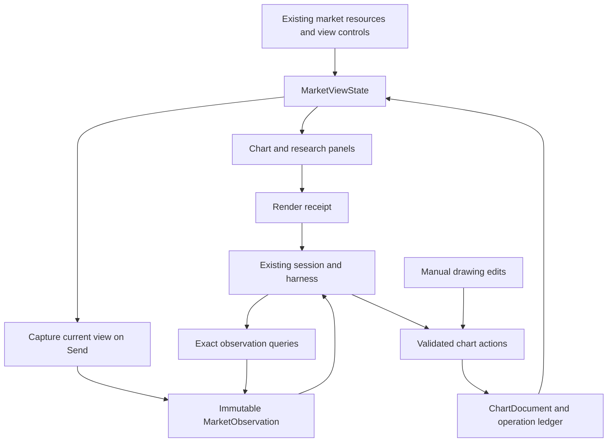

# Chart Agent architecture

Status: implementation plan, 2026-09-04. No feature code has been implemented.
Product intent: [VISION.md](VISION.md). Build sequence: [ROADMAP.md](ROADMAP.md).

## Architectural decision

Make chart awareness a capability of ordinary CopeNet sessions. Make drawing a capability
of the market workspace that both the operator and an agent can use. Keep those concerns
separate: a chart document should continue to work with the chat panel closed.

Four records have different lifetimes and must not become one large mutable state object:

| Record | Owner | Lifetime and role |
| --- | --- | --- |
| `MarketViewState` | Browser view projection | Current displayed data/configuration; changes as the UI changes |
| `MarketObservation` | Backend observation store | Immutable evidence captured for a model invocation |
| `ChartDocument` | Backend chart store | Durable editable drawing layers for a market workspace and instrument |
| `MarketTurnContext` | Existing orchestrator run | Authorized observation/document binding and evidence budget for this turn |

The arrow from the UI to agent context is data flow, not screen interpretation. Optional
images are a future additional resource. Neither screen scraping nor computer control is
required for this demo.

## Shared view projection

Extract a `useTickerViewModel` from `TickerWorkspace.tsx`. It owns the existing ticker
configuration and derivations and supplies the same arrays/values to chart components and
the capture builder. Preserve existing fetching, full-history indicator computation, and
symbol-transition behavior. Do not migrate the entire market application into a new store.

`MarketViewState` contains:

- `viewId` (per mounted browser view), `viewRevision`, displayed instrument, requested
  instrument/loading state, timeframe, range preset, actual viewport and selected region;
- current panes/scales, comparison mode, visible plots, indicator instances/configuration,
  document ID/revision and selected object IDs;
- resource descriptors and read access to the exact immutable arrays used for rendering;
- panel IDs, active filters, alignment/units, displayed values, freshness, coverage, and
  explicit loaded/empty/stale/error/not-loaded states;
- latest displayed quote and source timestamp, separate from historical candle resources.

The live projection can retain references and getters. The capture serializer produces a
plain-data DTO: no functions, React nodes, chart handles, or `ComputedIndicator.definition`
objects. Preserve numeric values and timestamps, including null gaps; rounded legend text
is supplementary. Both display formatting and projection use shared derivations.

Nested research panels currently own data and settings. Give each supported panel a typed
contribution callback/provider tied to its render model. Register/unregister by view and
panel generation. The capture builder reads their current committed contributions; a
missing contribution for a visible supported panel is a capture error, not silent omission.
Start with explicit entries for Overview, Fundamentals, SEC & Events, and Synthesis.
Do not introduce a generic plugin registry or DOM observer.

`CandleChart` must publish the actual logical/time viewport through a focused adapter.
Capture at send time includes partially visible edge candles and identifies whitespace
separately; a selected 5Y toolbar preset does not imply all five years are visible.
Keep semantic selection separate from a transient crosshair hover.

Live quote state currently lives below `TickerAssetBar`, in `TickerLiveQuote`, specifically
to avoid chart rerenders. Move subscription ownership into a view-scoped external store
with narrow subscribers; share its getter with capture and its subscription with the quote
component. Do not open a second Yahoo connection for the agent. Quote revisions do not
recompute historical indicators or invalidate drawing edits.

On Send, synchronously assemble a consistent local capture after pending semantic view
changes are committed. Include component resource revisions; do not await network requests
while taking the snapshot. Disable send while the initial chart is unready; a retained
stale view remains usable with explicit displayed-symbol/freshness attribution.

## Capture, provenance, and persistence

For the demo, capture the actual browser render inputs. This avoids a new backend fetch
silently giving the agent fresher/different data than the operator sees. The capture carries
loaded D/W/M candle datasets, plotted indicator outputs, comparison/financial resources,
supported panel projections, current quote, and exact displayed drawing records within
explicit limits. Store those drawings as an immutable observation resource, not just IDs
pointing to the current document. Historical evidence reads and current document reads are
different operations; subsequent edits/deletion never change what an earlier turn saw.
Detail setting does not discard the stored source data.

Validate the DTO once at the RPC boundary: allowed shapes, counts, finite values, timestamp
units, symbol/resource consistency, schema version, and total payload size. Treat captured
content as user-supplied evidence. Its provenance is `browser_capture` with upstream source
metadata where known; a content hash proves identity, not independent market-data accuracy.
Do not label a client-computed value “server verified.” Exact display/context parity and
canonical source/calculation correctness are separate tests.

Choose an indexed SQLite store under the existing local market data directory, with tables
for workspaces, documents, operations, observations, resources, and run admissions/bindings.
Use transactions for document revision compare-and-swap, operation dedupe, and its saved
receipt together. Use immutable content-addressed resource blobs to reuse repeated candle
or financial inputs across observations. SQLite is local storage, not a new service.

Persist the observation header and all referenced resource rows atomically before returning
its ID. Canonicalize validated JSON and hash on the server; IDs and hashes are server issued.
Share TS/Python serialization fixtures without duplicating the hashing implementation.
The first capture can upload resources inline; later captures may reference
already stored resource IDs from prior receipts. An unknown reference fails explicitly.
Keep that reference optimization within the same versioned contract, not a parallel API.

Initial engineering limits, subject to fixture measurement before merging: 8 MiB decoded
capture, 32 resources, 25,000 rows per resource, 200 drawings per document, 20 operations
per batch, and a configurable 512 MiB chart-store capacity. Enforce a transport byte bound
before JSON parsing as well as decoded schema limits. Oversize capture fails with an
actionable message; it must not silently trim visible data. Do not spend model quota after
a failed capture. Larger sources can gain chunked ingestion later without changing queries.

Delete unbound captures after 24 hours; retain run-bound observations and document evidence
until explicit removal. At capacity, fail new captures clearly rather than evict referenced
evidence. Run/session archive is not deletion. Garbage collection only removes unreferenced
resources. Add an explicit workspace cleanup action with dependency checks; old citations
must return “removed/unavailable” if an operator intentionally deletes their evidence.

Use ArtifactStore for a compact per-run observation manifest and action receipts that link
to this store. Do not store the only exact dataset there: its current `get()` searches the
latest 500 session artifacts. Run tracing carries IDs, revisions, counts, and timings;
payloads follow existing debug-tier rules. Account information remains local and never
enters checked-in fixtures/screenshots.

## Instrument identity and time

New chart records use an `InstrumentRef` with opaque stable `instrumentId`, display symbol,
asset class, source/venue scope, currency, and optional base/quote assets. The demo adapts
existing equity/ETF symbols at this boundary. Do not rename every existing market DTO.
Do not pretend the current Yahoo aggregate feed identifies a single exchange order book.

Store interval and price basis explicitly. Candle anchors use the existing candle timestamp
plus source interval/basis; they never store a screen coordinate. Future event timestamps
use a declared unit and a lossless representation for precision beyond JS safe integers.
Order-book decimal quantities/prices will retain exact decimal strings or scaled integers;
conversion to chart floats belongs at rendering, not in canonical book maintenance.

Keep independent `viewRevision`, `documentRevision`, and per-resource revision/watermark.
A quote tick must not cause a document conflict. A frozen observation records all of these
plus per-source freshness; its capture timestamp does not imply simultaneous upstream data.

## Session and harness integration

Retain normal sessions, run records, provider locks, streaming, cancellation, and transcript
replay. Store the Market workspace's selected session link outside SessionStore's locked
runtime binding. One continuing Market conversation follows ticker navigation between
turns; pinning a ticker is a view preference. A chart document belongs to its workspace
and instrument, so starting another conversation does not discard drawings.

Extract an explicit-target send function from `wsChatActions.ts`. Both the Agents wrapper
and Market companion call it with a captured session key/runtime configuration. The Market
draft is local to its workspace, never `DRAFT_TRANSCRIPT_SESSION_KEY`; creating/sending it
does not mutate Agents' active session or draft. Reuse `MessageBubble`, grouped tools,
inspector, composer primitives and run-index cache. Extract reusable conversation rendering
from the oversized `ChatWorkspace`; do not embed its global session controller.

Flow:

1. Capture the displayed state and a stable request ID. Create the normal session on first
   send if necessary, with Market-local draft settings.
2. Call `market.chart.capture` with session/workspace/view identity and the immutable payload.
   Return `observationId`, document identity/revision, resource IDs, and capture receipt.
3. Call ordinary `chat.send` with the same stable `idempotencyKey` and typed optional
   `marketContext` (observation ID, document ID, view ID, detail, requested chart access).
4. Before accepting the chart run, validate ownership, document/instrument match and access;
   admit through the existing in-flight lock. Bind the observation immutably to the run.
   Retries with the same key must have identical context; a changed context is an error.
5. Project context into the normal message builder, build scoped tools, then run the existing
   harness. Record observation/context references on transcript and run metadata with safe
   defaults for older records. Do not overwrite the user's prompt or replace system policy.

Persist a chart admission fingerprint (message, runtime request, observation, authority) and
state before transcript append/provider dispatch. Current `_idempotency_cache` is memory-only;
it cannot provide restart-safe dedupe. Chart admission states distinguish prepared, admitted,
terminal, and interrupted/uncertain. Reconcile against RunStore, SessionStore's in-flight
binding, and existing transcript run IDs on restart; do not claim a transaction spans those
stores. An uncertain admitted request is never automatically dispatched again. Return its
known status/evidence and require a new user turn to continue, preserving committed batches.
Prepared requests may continue only when reconciliation proves dispatch never began. Same
request key/different fingerprint conflicts; a completed retry reads its recorded outcome.
Keep this change scoped to chart-bound admission while preserving ordinary session locks.

First-send draft session creation also needs a stable key: use the existing explicit session
key creation path and persist the pending Market draft identity before requesting creation.
Resolve an uncertain creation by that key and verify its binding before retrying; never
generate a second session just because a response was lost.

`MarketTurnContext` is a typed optional dependency on `ToolExecutionContext`, constructed by
the orchestrator. Never accept session/run/actor authority from tool arguments. Historical
turns replay a bounded evidence summary and exact observation reference, not the entire
dataset on every turn. Verify this in the actual provider payloads, including native resume;
historical tool-result replay and prompt compaction must obey the same budget.
The resumed Claude CLI branch currently sends only `message`; explicitly include the
current bounded observation projection there as well as in structured provider messages.

The demo reads its captured observation throughout a turn. It does not pretend a local
variable update reaches a running model. Current-view reads can be added later with a
separate capture handshake that returns a new observation ID. A tool needing unavailable
data returns that limitation; existing live `market.ticker` is not a substitute.

## RPC and tool contracts

Transport handlers are thin additions under `rpc_market_chart.py`, dispatched from
`rpc_dispatch.py`. Domain services are shared by RPC/manual edits and agent handlers.

| RPC | Purpose |
| --- | --- |
| `market.chart.workspace.get` | Resolve persistent workspace/session link and current instrument document |
| `market.chart.workspace.update` | Set selected normal session and workspace preferences |
| `market.chart.capture` | Validate and store an immutable view observation idempotently |
| `market.chart.document.get` | Fetch a document revision and operation/render receipts |
| `market.chart.apply` | Apply one revision-checked drawing batch |
| `market.chart.undo` | Append a compensating operation for a batch |
| `market.chart.rendered` | Report view/document revision rendered, inapplicable, or failed |

| Model tool | Purpose |
| --- | --- |
| `market.chart.context` | Compact scene inventory and evidence coverage for the bound observation |
| `market.chart.read` | Exact resource/window/field query with bounded pagination |
| `market.chart.document` | Read current drawing objects, revisions, and receipts |
| `market.chart.apply` | Add/update/remove drawing objects in the permitted layer |
| `market.chart.undo` | Undo an eligible batch using the same domain service |

Read requests use an observation/resource ID, typed allowed fields, range, cursor, and limit;
responses carry source identity, units, total/returned counts, omitted ranges, and next cursor.
Defaults use the bound observation; explicit historical IDs require session/workspace access.
Pagination cursors bind the exact query and immutable resource. No arbitrary SQL or code.

Action requests carry `operationId`, `documentId`, `expectedRevision`, and typed operations.
Return `batchId`, resulting revision, affected object IDs, and applied/conflict/rejected status.
Register exact tool IDs through `handlers/market.py` and `MANIFEST_TOOL_IDS`; no generated
tool naming or hidden special execution path. Start with explicit raw previews supported
by the inspector, plus a small typed drawing receipt renderer shipped in the same commit.

## Chart actions and authorization

Introduce `chart-write` in the shared tool category/policy vocabulary. It grants only
document operations under a validated MarketTurnContext. Baseline chart access can be
`read` or `annotate`; opening the demo companion defaults to annotate for its agent layer
and clearly exposes the toggle. This is permission to annotate that chart, not filesystem
Full Access. `requires_confirmation` is not used as the sole enforcement mechanism.

Each turn's effective tools are the intersection of normal policy, provider capability,
the chart product's allowed tool IDs, and the binding's authority. Enforce this at execution
as well as in the manifest. First demo chart turns expose only the five chart tools; broad
dashboard/ticker/shell/memory tools cannot bypass captured scope. Ordinary Agents sessions
retain their existing tools. Keep account-derived panel resources excluded by default;
include them only via explicit chart context selection enforced before capture and reads.

Account inclusion controls newly supplied resources, not what a reused conversation or
its profile already contains. Default to a new dedicated Market session; disclose existing
account context when reconnecting an older one. Turning inclusion off cannot retract data
already sent. Strictly account-free analysis requires a fresh session and appropriate
profile/persona context, not a misleading toggle over existing history.
Every query of historical observations enforces the current resource inclusion scope;
ownership of an old observation alone does not grant access to excluded account resources.

Preserve the existing Barricade side-effect gate. A session that has ingested untrusted
web content may require approval for a drawing write; chart access does not bypass that
gate. Propagate source trust for captured external prose through the existing security
state before model execution. Extract `_make_approval_gated_executor` from the oversized
orchestrator runtime and generalize its shell-only description/payload to exact typed
tool arguments. A drawing approval shows the actual batch, binds its argument digest,
and rechecks revision/scope at execution. Rejection/timeout/abort uses the normal UI;
approval cannot bless a revised batch or grant shell authority.

The backend stamps actor/session/run. Agent operations target that session's agent layer;
manual layers and other agents' layers are readable but protected. A manual edit of an
agent object marks it operator-controlled; further model edits require a specific grant.
The demo can keep such objects read-only to the model and let the operator duplicate them
into its editable layer. This bounded rule is preferable to inferring permission from prose.

Apply batches atomically. Compare expected document revision, validate all objects/evidence
references, then persist document and operation receipt together. Same operation ID and
same payload returns its original receipt; different payload is rejected. Conflicts require
a fresh document read and a new operation. Undo appends an inverse batch; it never rewinds
over intervening edits to affected objects. Aborting a model turn does not undo already
committed drawings; the batch remains explicitly undoable.

First objects: horizontal level, time-bounded price zone, two-anchor trendline, anchored
label. Store exact anchors, symbol/interval/basis applicability, style, evidence references,
rationale, and owner. Provide manual creation/editing through the same operations. Selecting
a chat receipt highlights the objects; selecting an object opens its provenance inspector.

Use a Lightweight Charts series primitive attached to the relevant series, with one focused
coordinate adapter and hit-testing/gesture controller. The installed v5.2 API supports this
extension point; see [official series primitive documentation](https://tradingview.github.io/lightweight-charts/docs/plugins/series-primitives).
Keep annotation geometry in pure functions, rendering in the adapter, and editing outside
the renderer. Default annotations do not expand price autoscale. Test pane/log/DPR transforms.

Demo drawings are price-pane and interval-specific. Hide with a reason in incompatible
comparison mode or intervals, restore when returning, and retain original anchors. Pan/zoom
must neither mutate anchors nor inject new time-axis slots. Future projection geometry,
cross-interval transformation, and indicator-pane drawing require separate explicit rules.

Document persistence and browser rendering are separate facts. Broadcast document changes
with document ID/revision; clients ignore unrelated views and recover by fetching on reconnect.
The initiating visible view acknowledges after its drawing renderer has processed that
revision. Wait only a bounded interval for that receipt, then return “saved; display pending.”
An offscreen or disconnected view cannot claim rendering. Navigation from A to B may finish
and save an A drawing, but must never render it on B. Render errors never roll back saved data.

## Context detail and cost

Implement Quick/Balanced/Deep as an evidence policy, independent of provider reasoning
settings, output length, and invocation frequency. Begin with measured, configurable caps:
2K/5K/10K estimated tokens for the initial view projection and 4/8/12 chart read calls. These
are engineering starting points, not promised usage; intersect them with the harness's
remaining context/tool budget and reserve room for the answer.

Identity, units, freshness, coverage, selected objects, and an exact selected candle get
priority at every detail. Balanced includes recent exact bars and active indicator values;
Deep adds wider windows/multiple supported timeframes. Whole stored resources remain queryable
within budget at every setting. Paginate tool results before generic harness clipping and
record any subsequent clipping. Measure actual provider-reported usage when available.

## Crypto and order-book extension

Prepare contracts now; do not connect an exchange in the demo. Existing quote and candle
resources are concrete types. Later add explicit `trades` and `order_book` variants rather
than a generic unvalidated JSON payload. A venue's order book needs venue-specific identity;
BTC-USD from two exchanges is not the same instrument observation.

The later data path is exchange adapter → validated snapshot/deltas → canonical book reducer
→ bounded observation buffers/metrics → view projection and agent queries. The adapter owns
subscription/sequence/checksum conventions. For example, Coinbase's documented level2
quantity updates replace the size at a price level; zero removes it. Treating them as
increments would corrupt the book. See [level2 semantics](https://docs.cdp.coinbase.com/coinbase-business/advanced-trade-apis/websocket/websocket-channels).

Keep source event time, receive time, stream generation, sequence/watermark, depth coverage,
and valid/stale/resyncing status. On a detected gap, restart from a valid snapshot according
to that feed's protocol; do not publish a partially reconstructed book as current. Coinbase
also documents dropped/out-of-order message handling in its [WebSocket overview](https://docs.cdp.coinbase.com/coinbase-app/advanced-trade-apis/websocket/websocket-overview).

Separate three rates: ingestion applies every required update; UI paints coalesced latest
state; model invocation happens on user request or later bounded event triggers. Dropping
intermediate UI paints is fine; dropping required deltas before the book reducer is not.
Backpressure that prevents correctness forces resync. Use bounded queues and connection
leases; do not route every tick through React, the chat transcript, or an LLM call.

An agent observation records the exact retained depth and per-stream watermark. Depth
truncation is explicit. Short buffered windows can support spread, depth, imbalance, and
changes over time; a single book snapshot cannot establish persistence or execution history.
Long-term heatmaps/replay require an explicit retention/storage feature, not a promise that
the agent can retrieve history never recorded. Keep new 24/7/intraday candle policies separate
from the existing completed US-equity D/W/M alert engine.

## Module boundaries

New backend domain: `core/market/chart_workspace/` with focused `models.py`, `store.py`,
`observations.py`, `projection.py`, `queries.py`, `documents.py`, and `authorization.py`.
The service is instantiated/injected once by the orchestrator; handlers do not construct
fresh unrelated runtimes. A focused orchestrator `market_context.py` owns run integration.

Frontend: `sections/market/viewState/` for typed capture/contributions/quote projection;
`sections/market/drawings/` for objects, geometry, primitives, and interactions;
`sections/market/chartAgent/` for the companion, context controls, and session linkage.
Keep transport additions in `lib/wsMarketChart.ts`; keep heavy evidence out of `useAppStore`.

Extract only touched concerns from `TickerWorkspace`, `CandleChart`, `ChatWorkspace`,
`AgentComposer`, and oversized backend modules before expanding them. Reuse current
indicator and financial calculations. No provider-specific chart tools, new chatbot runtime,
generic event platform, or second calculation engine.

Specifically, extract request contracts from `orchestrator/__init__.py`, approval execution
and turn preparation from `orchestrator/runtime.py`, and preview/effect projection from
`tools/contracts.py` before expanding them. Update callers to the canonical extracted
definitions in the same commit; do not introduce permanent re-export compatibility shims.
