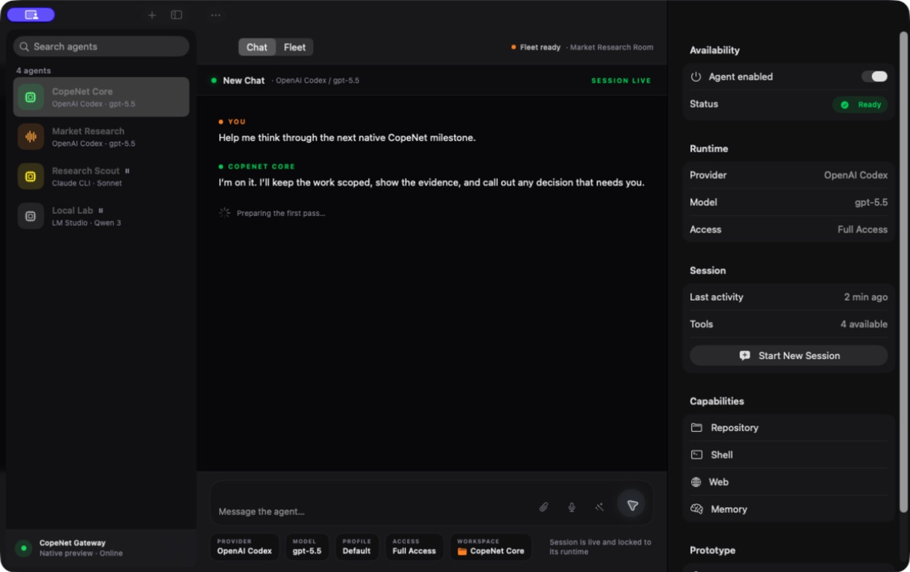

# CopeNet Apple Agents Prototype

A standalone SwiftUI exploration of CopeNet's Agents panel. It does not import
or modify the CopeNet backend or React frontend.


## Run

```sh
cd prototypes/CopeNetApple
swift run CopeNetApple
```

The package uses only Apple frameworks and mocked data behind
`AgentRepository`. The included build script creates a double-clickable macOS
app bundle in `.build/CopeNet Agents.app`.

```sh
./scripts/build-app.sh
open ".build/CopeNet Agents.app"
```

## Data boundary

`MockAgentRepository` is the only current data source. A live implementation can
replace it with a WebSocket repository that maps CopeNet's existing
`providers.list`, `sessions.list`, `sessions.history`, and run/activity RPC
responses into `AgentProfile` values. Starting a session would delegate to the
same session-create/chat-send flow already used by the web client.

## Prototype interaction

Selecting an agent updates the workspace and inspector. The enabled toggle is
live in memory. Opening moves and quick starters populate the composer, sending
the first message transitions the workspace into a live chat, and the native
Chat/Fleet segmented control switches workspace modes.

The visual direction uses a deep-black operator console, restrained orange
mission accents, native materials and controls, serif display typography, and
compact runtime chips. It remains a real adaptive SwiftUI layout rather than a
fixed screenshot recreation.


